<h2>记录学习Vue之路</h2>

禹神四件套，各个No1，B站天花板！

1、**前端基础** : [尚硅谷前端入门html+css零基础教程，零基础前端开发html5+css3视频](https://www.bilibili.com/video/BV1p84y1P7Z5/?spm_id_from=333.788.comment.all.click&vd_source=0aba82a4002c00e3a072b82df5f53868)

2、Vue3.0: [尚硅谷Vue3入门到实战，最新版vue3+TypeScript前端开发教程](https://www.bilibili.com/video/BV1Za4y1r7KE/?spm_id_from=333.788.comment.all.click&vd_source=0aba82a4002c00e3a072b82df5f53868)

3、Vue全家桶(当前学习): [尚硅谷Vue2.0+Vue3.0全套教程丨vuejs从入门到精通](
https://www.bilibili.com/video/BV1Zy4y1K7SH/?p=6&spm_id_from=pageDriver&vd_source=0aba82a4002c00e3a072b82df5f53868)

4、React: [尚硅谷React教程（已加更新版内容，B站最火）](https://www.bilibili.com/video/BV1wy4y1D7JT/?spm_id_from=333.788.comment.all.click&vd_source=0aba82a4002c00e3a072b82df5f53868)


```
温馨提示: 此readme.md文件,是通过禹神课件PDF文件通过WPS转成word,再由word通过pandoc工具转成markdown格式,故存在错误，请见谅。具体内容可看课件文件夹里面的内容。
```


> **一、** **前序知识**
>
> **1.** **认识两位先驱**

{width="6.17995406824147in"
height="1.041994750656168e-2in"}

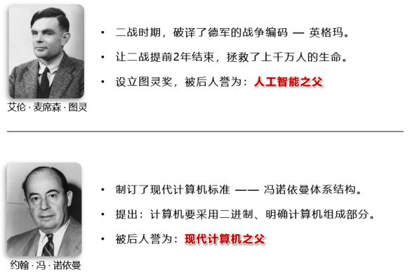{width="6.0757392825896765in"
height="4.022703412073491in"}

> {width="6.17995406824147in"
> height="1.0421041119860017e-2in"}**2.** **计算机基础知识**
>
> 1\.
> **计算机**俗称电脑，是现代一种用于高速计算的电子计算机器，可以进行数值计算、逻辑计算，还
> 具有存储记忆功能。
>
> 2\. 计算机由 **硬件** + **软件** 成：
>
> 。 硬件：看得见摸得着的物理部件。
>
> 。 软件：可以指挥硬件工作的指令。
>
> 3\. 软件的分类：
>
> 1\. 系统软件： Windows、 Linux、Android、 Harmony 等。
>
> 2\. 应用软件：微信、 QQ、王者荣耀、 PhotoShop 等。
>
> 4\. 整体图示：

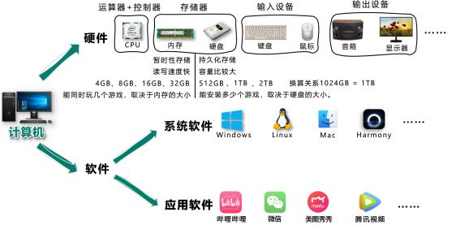{width="5.7943580489938755in"
height="2.8763363954505685in"}

> **3.** **C/S架构与B/S架构**

+-----------------------------------------------------------------------------------------------------------------+
| > 1\. 上面提到的应用软件，又分为两大类：                                                                        |
| >                                                                                                               |
| > 。 **C/S架构**，特点：需要安装、偶尔更新、不跨平台、开发更具针对性。 。                                       |
| > **B/S架构**，特点：无需安装、无需更新、可跨平台、开发更具通用性。                                             |
+-------------------------+---------------------------------------------------------------------------------------+
|                         | > 名词解释： C =\> client（客户端）、 B =\> browser（浏览器）、 S =\>                 |
|                         | > server（服务器）。                                                                  |
|                         | >                                                                                     |
|                         | > 服务器 ：为软件提供数据的设备（在背后默默的付出）。                                 |
+-------------------------+---------------------------------------------------------------------------------------+
| > 2\. **前端工程师，主要负责编写** **B/S架构中的网页（呈现界面、实现交互）** 。                                 |
+-------------------------+---------------------------------------------------------------------------------------+
|                         | > 备注：大前端时代，我们可以用前端的技术栈，做出一个C/S架构的应用、甚至搭建一个服     |
|                         | > 务器囤。                                                                            |
+-------------------------+-------------------------------------------+-------------------------------------------+
| > **4.** **浏览器相关知识**                                         |                                           |
+---------------------------------------------------------------------+-------------------------------------------+

> 浏览器是网页运行的平台，常见的浏览器有： 谷歌(Chrome) 、 Safari 、 IE
> 、 火狐(Firefox) 、 欧 朋(Opera) 等，以上这些是常用的五大浏览器。
>
> **1.各大浏览器市场份额：**

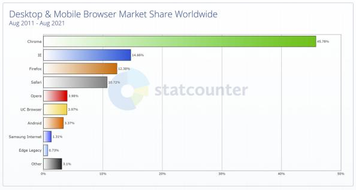{width="6.179952974628171in"
height="3.3036176727909012in"}

> **2.常见浏览器的内核：**

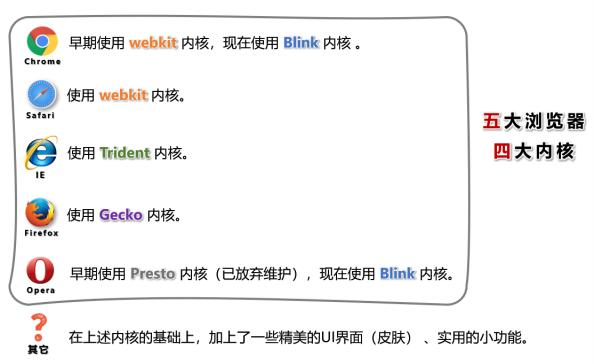{width="6.17995406824147in"
height="3.7830074365704287in"}

> {width="6.17995406824147in"
> height="1.041994750656168e-2in"}**5.** **网页相关概念**
>
> 1\. 网址：我们在浏览器中输入的地址。
>
> 2\. 网页：浏览器所呈现的每一个页面。
>
> 3\. 网站：多个网页构成了一个网站。
>
> 4\. 网页标准：

{width="5.794359142607174in"
height="2.1780938320209975in"}

> **二、** **HTML** **简介**
>
> **1.** **什么是** **HTML？**

+-----------------------------------------------------------------------------------------------+
| 全称： HyperText Markup Language（超文本标记语言）。                                          |
+-----------------------------------------------------------------------------------------------+
| > 超文本：暂且简单理解为 "超级的文本" ，和普通文本比，内容更丰富。                            |
| >                                                                                             |
| > 标 记：文本要变成超文本，就需要用到各种标记符号。                                           |
| >                                                                                             |
| > 语 言：每一个标记的写法、读音、使用规则，组成了一个标记语言。                               |
+------------------------------------------------+----------------------------------------------+
| **2.** **相关国际组织（了解）**                |                                              |
+------------------------------------------------+----------------------------------------------+
| **1.** **IETF**                                                                               |
+-----------------------------------------------------------------------------------------------+
| > 全称： Internet Engineering Task Force（国际互联网工程任务组），成立于1985年底，是一个权威  |
| > 的互联网技术标准化组织，主要负责互联网相关技术规范的研发和制定，当前绝大多数国际互联网      |
| > 技术标准均出自IETF。官网： [**https://www.ietf.org**](https://www.ietf.org/)                |
+-----------------------------------------------------------------------------------------------+
| **2.** **W3C**                                                                                |
+-----------------------------------------------------------------------------------------------+
| > 全称：World Wide Web Consortium （万维网联盟），创建于1994年，是目前Web技术领域，最具影     |
| > 响力的技术标准机构。共计发布了200多项技术标准和实施指南，对互联网技术的发展和应用起到       |
| > 了基础性和根本性的支撑作用，官网： [**https://www.w3.org**](https://www.w3.org/)            |
+-----------------------------------------------------------------------------------------------+
| **3.** **WHATWF**                                                                             |
+-----------------------------------------------------------------------------------------------+
| > 全称：Web Hypertext Application Technology Working Group （网页超文本应用技术工作小组）成立 |
| > 于2004年，是一个以推动网络HTML5 标准为目的而成立的组织。由Opera、 Mozilla基金会、苹果，     |
| > 等这些浏览器厂商组成。官网： [**https://whatwg.org/**](https://whatwg.org/)                 |
+------------------------------------------------+----------------------------------------------+
| **3.** **HTML** **发展历史（了解）**           |                                              |
+------------------------------------------------+----------------------------------------------+

> 从 HTML 1.0 开始发展， 期间经历了很多版本，目前HTML的最新标准是： HMTL
> 5，具体发展史如图（了 解即可）。

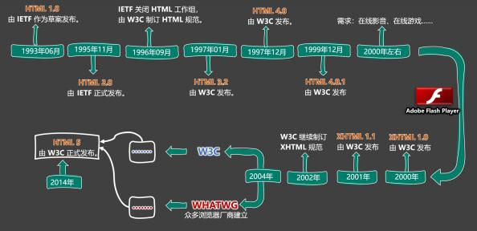{width="6.17995406824147in"
height="2.990972222222222in"}

> **三、** **准备工作**
>
> **1.** **常用电脑设置**

+-------------------------------------------------------------------------------------+
| > 1\. 查看文件夹内容的几种布局。                                                    |
| >                                                                                   |
| > 2\. 展示文件扩展名（文件后缀）。                                                  |
| >                                                                                   |
| > 3\. 使用指定程序打开文件。                                                        |
| >                                                                                   |
| > 4\. 配置文件的默认打开方式。                                                      |
+-----------------------------------------------+-------------------------------------+
| > **2.** **安装Chrome浏览器**                 |                                     |
+-----------------------------------------------+-------------------------------------+
| > 1\. 下载地址： [**https://www.google.cn/chrome**](https://www.google.cn/chrome)。 |
| >                                                                                   |
| > 2\. 若上述地址打不开，或无法安装，请使用资料中的离线安装包。                      |
| >                                                                                   |
| > 3\. 详细步骤请参考视频。                                                          |
+-----------------------------------------------+-------------------------------------+
| > **四、** **HTML** **入门**                  |                                     |
| >                                             |                                     |
| > **1.** **HTML** **初体验**                  |                                     |
+-----------------------------------------------+-------------------------------------+

> 1\. 第一步：鼠标右键 =\> 新建 =\> 文本文档 =\> 输入以下内容，并保存。

+-----------------------------------------------------------------------+
| > \<marquee\>尚硅谷，让天下没有难学的技术！\< /marquee\>              |
+-----------------------------------------------------------------------+

> 2\. 第二步：修改后缀为 .html ，然后双击打开即可。
>
> 3\. 程序员写的叫 **源代码** ，要交给浏览器进行渲染。
>
> 4\. 借助浏览器看网页的 **源代码**，具体操作：
>
> {width="6.17995406824147in"
> height="1.0423228346456693e-2in"}**2.** **HTML** **标签**
>
> 1\. **标签** 又称 **元素**，是HTML的基本组成单位。
>
> 2\. 标签分为： **双标签** 与 **单标签** （绝大多数都是双标签）。
>
> 3\. 标签名不区分大小写，但推荐小写，因为小写更规范。 4. 双标签：

{width="4.168525809273841e-2in"
height="1.9800885826771653in"}

{width="3.4495188101487315in"
height="0.9900426509186352in"}

> 示例代码：

+-----------------------------------------------------------------------+
| > \<marquee\>尚硅谷，让天下没有难学的技术！\< /marquee\>              |
+-----------------------------------------------------------------------+

> 5\. 单标签：
>
> 6\. 标签之间的关系：并列关系、嵌套关系，可以使用 tab 键进行缩进：

+-----------------------------------------------------------------------+
| > \<marquee\>                                                         |
| >                                                                     |
| > 尚硅谷，让天下没有难学的技术！                                      |
| >                                                                     |
| > \<input\> \< /marquee\> \<input\>                                   |
+-----------------------------------------------------------------------+

> **3.** **HTML** **标签属性**

{width="6.17995406824147in"
height="1.0423228346456693e-2in"}

> 1\. 用于给标签提供 **附加信息**。
>
> 2\. 可以写在： **起始标签** 或 **单标签中**，形式如下：
>
> 3\. 有些特殊的属性，没有属性名，只有属性值，例如：

+-----------------------------------------------------------------------+
| > \<input disabled\>                                                  |
+-----------------------------------------------------------------------+

> {width="4.168525809273841e-2in"
> height="2.2406277340332457in"}4. 注意点：
>
> 1\.
> 不同的标签，有不同的属性；也有一些通用属性（在任何标签内都能写，后面会详细
> 总结）。
>
> 2\. 属性名、属性值不能乱写，都是W3C规定好的。
>
> 3\. 属性名、属性值，都不区分大小写，但推荐小写。
>
> 4\. 双引号，也可以写成单引号，甚至不写都行，但还是推荐写双引号。
>
> 5\. 标签中不要出现同名属性，否则后写的会失效，例如：

+-----------------------------------------------------------------------+
| > \<input type= \"text \" type= \"password \"\>                       |
+-----------------------------------------------------------------------+

> {width="6.17995406824147in"
> height="1.0423228346456693e-2in"}**4.** **HTML** **基本结构**
>
> 1\. 在网页中，如何查看某段结构的具体代码？ ------
> 点击鼠标右键，选择"检查"。
>
> 2\. 【检查】 和 【查看网页源代码】的区别：

{width="4.168525809273841e-2in"
height="0.9692038495188101in"}

> 【查看网页源代码】看到的是：程序员编写的源代码。
>
> 【检查】看到的是：经过浏览器 "处理" 后的源代码。
> 备注：日常开发中，【检查】用的最多。
>
> 3\. 网页的 **基本结构** 如下：

{width="4.168525809273841e-2in"
height="1.083834208223972in"}

> 1\. 想要呈现在网页中的内容写在 body 标签中。
>
> 2\. head 标签中的内容不会出现在网页中。
>
> 3\. head 标签中的 title 标签可以指定网页的标题。
>
> {width="4.168525809273841e-2in"
> height="6.034041994750656in"}4. 图示：

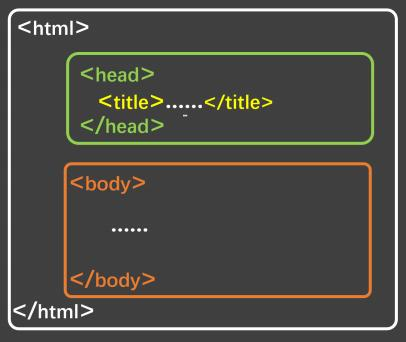{width="4.220710848643919in"
height="3.5537335958005247in"}

> 5\. 代码：

+-----------------------------------------------------------------------+
| > \<html\>                                                            |
| >                                                                     |
| > \<head\>                                                            |
| >                                                                     |
| > \<title\>网页标题\</title\> \< /head\>                              |
| >                                                                     |
| > \<body\>                                                            |
| >                                                                     |
| > . . . . . .                                                         |
| >                                                                     |
| > \< /body\> \< /html\>                                               |
+-----------------------------------------------------------------------+

> {width="6.17995406824147in"
> height="1.0423228346456693e-2in"}**5.** **安装** **VSCode**
>
> 1\. 安装中文语言包。
>
> 2\. 使用 VSCode打开文件夹的两种方式。
>
> 3\. 调整字体大小。
>
> 4\. 设置主题。
>
> 5\. 安装图标主题： vscode-icons 。
>
> 备注：详细安装步骤请参考视频。
>
> {width="6.17995406824147in"
> height="1.0423228346456693e-2in"}**6.** **安装** **Live**
> **Server插件**
>
> 1\. 可以更加方便的打开网页。
>
> 2\. 打开网页的方式更贴近项目上线。
>
> 3\. 代码出现改动后，可以自动刷新。
>
> {width="4.168525809273841e-2in"
> height="0.4898206474190726in"}4. 根据自己的情况，去配置一下 VSCode
> 的自动保存。
>
> 注意1：务必使用VSCode打开的是文件夹，否则 Live
> Server插件无法正常工作！
>
> {width="6.17995406824147in"
> height="1.0423228346456693e-2in"}**7.** **HTML** **注释**
>
> 1\.
> 特点：注释的内容会被浏览器所忽略，不会呈现到页面中，但源代码中依然可见。
>
> 2\. 作用：对代码进行解释和说明。
>
> 3\. 写法：

+-----------------------------------------------------------------------+
| > \< !\-- 下面的文字只能滚动一次 \--\>                                |
| >                                                                     |
| > \<marquee loop= \"1 \"\>尚硅谷\</marquee\>                          |
| >                                                                     |
| > \< !\-- 下面的文字可以无限滚动 \--\>                                |
| >                                                                     |
| > \<marquee\>尚硅谷123\< /marquee\>                                   |
+-----------------------------------------------------------------------+

> 4\. 注释不可以嵌套，以下这么写是错的（反例）。

+-----------------------------------------------------------------------+
| > \< !\--                                                             |
| >                                                                     |
| > 我是一段注释                                                        |
| >                                                                     |
| > \< !\-- 我是一段注释 \--\>                                          |
| >                                                                     |
| > \--\>                                                               |
+-----------------------------------------------------------------------+

> {width="6.17995406824147in"
> height="1.0423228346456693e-2in"}**8.** **HTML** **文档声明**
>
> 1\. 作用：告诉浏览器当前网页的版本。
>
> 2\. 写法：
>
> 。 **旧写法**：要依网页所用的HTML版本而定，写法有很多。
>
> 具体有哪些写法请参考
> ：[**W3C官网-文档声明**](https://www.w3.org/QA/2002/04/valid-dtd-list.html)
> （了解即可，千万别背！）
>
> 。 **新写法：** 一切都变得简单了！ W3C 推荐使用 HTML 5 的写法。

+------------+------------------------------------------------------------+
| > \<       | > html\> HTML\>                                            |
| > !DOCTYPE | >                                                          |
| >          | > html\>                                                   |
| > 或       |                                                            |
| >          |                                                            |
| > \<       |                                                            |
| > !DOCTYPE |                                                            |
| >          |                                                            |
| > 或       |                                                            |
| >          |                                                            |
| > \<       |                                                            |
| > !doctype |                                                            |
+------------+------------------------------------------------------------+

> 3\. 注意：文档声明，必须在网页的第一行，且在 html 标签的外侧。
>
> {width="6.17995406824147in"
> height="1.0416666666666666e-2in"}**9.** **HTML** **字符编码**
>
> 1\. 计算机对数据的操作：
>
> 。 存储时，对数据进行： **编码**。
>
> 。 读取时，对数据进行： **解码**。
>
> 2\. 编码、解码，会遵循一定的规范 ------ **字符集**。
>
> 3\. 字符集有很多中，常见的有（了解）：

{width="4.168525809273841e-2in"
height="1.302691382327209in"}

> 1\. ASCII ：大写字母、小写字母、数字、 一些符号，共计128个。
>
> 2\. ISO 8859-1 ：在 ASCII 基础上，扩充了一些希腊字符等，共计是256个。
>
> 3\. GB2312 ：继续扩充，收录了 6763 个常用汉字、 682个字符。
>
> 4\. GBK ：收录了的汉字和符号达到 20000+ ，支持繁体中文。
>
> 5\. UTF-8 ：包含世界上所有语言的：所有文字与符号。 ------ 很常用。
>
> {width="4.168525809273841e-2in"
> height="0.6982349081364829in"}4. 使用原则是怎样的？
>
> 原则1：存储时，务必采用合适的字符编码 。
>
> 否则：无法存储，数据会丢失！

{width="4.168525809273841e-2in"
height="0.6878182414698163in"}

> 原则2：存储时采用哪种方式编码 ，读取时就采用哪种方式解码。
>
> 否则：数据错乱（乱码）！

+------------------------------------------------------------------------------------------------------------------------------------------+
| > 例如下面文字中，包含有：中文、英文、泰文、缅甸文                                                                                       |
+-------------------------------------+----------------------------------------------------------------------------------------------------+
|                                     | > 我爱你                                                                                           |
|                                     | >                                                                                                  |
|                                     | > I love you !                                                                                     |
|                                     | >                                                                                                  |
|                                     | > ั ั                                                                                                |
|                                     | >                                                                                                  |
|                                     | > ฉนรกเธอนะ                                                                                        |
|                                     | >                                                                                                  |
|                                     | > {width="5.0207786526684166e-2in"                                  |
|                                     | > height="5.0669291338582674e-2in"} {width="6.022747156605424e-2in" |
|                                     | > height="4.997812773403325e-2in"} {width="5.0207786526684166e-2in" |
|                                     | > height="5.0669291338582674e-2in"}                                                                |
|                                     | > {width="5.0207786526684166e-2in"                                  |
|                                     | > height="5.0669291338582674e-2in"}                                                                |
|                                     | >                                                                                                  |
|                                     | > {width="0.11604440069991251in"                                    |
|                                     | > height="6.1148293963254594e-2in"}d⃞{width="6.573490813648294e-2in" |
|                                     | > height="6.068788276465442e-2in"}{width="0.11604440069991251in"    |
|                                     | > height="0.11388998250218722in"} {width="6.40080927384077e-2in"    |
|                                     | > height="6.1148293963254594e-2in"}{width="0.1216852580927384in"    |
|                                     | > height="0.11665463692038495in"}{width="0.11604440069991251in"     |
|                                     | > height="6.1148293963254594e-2in"}{width="0.11592957130358705in"   |
|                                     | > height="6.1148293963254594e-2in"}Ⅱ                                                               |
+-------------------------------------+----------------------------------------------------------------------------------------------------+
| > 若使用 ISO8859-1 编码存储，在存入的那一刻，就出问题了，因为 ISO8859-1 仅支持英 文！                                                    |
| >                                                                                                                                        |
| > 为保证所有的输入，都能正常存储和读取，现在几乎全都采用： UFT-8 编码。                                                                  |
| >                                                                                                                                        |
| > 所以我们编写 html 文件时，也都统一用 UFT-8 编码。                                                                                      |
+------------------------------------------------------------------------------------------------------------------------------------------+

> 5\. 总结：
>
> 。 平时编写代码时，统一采用 UTF-8 编码（最稳妥）。
>
> 。 为了让浏览器在渲染 html 文件时，不犯错误，可以通过 meta 标签配合
> charset 属性指 定字符编码。

+-----------------------------------------------------------------------+
| > \<head\>                                                            |
| >                                                                     |
| > \<meta charset= \"UTF-8 \" /\> \< /head\>                           |
+-----------------------------------------------------------------------+

> {width="6.17995406824147in"
> height="1.0423228346456693e-2in"}**10.** **HTML** **设置语言**
>
> 1\. 主要作用：
>
> {width="0.1354790026246719in"
> height="0.13547681539807524in"} 让浏览器显示对应的翻译提示。
> {width="0.1354790026246719in"
> height="0.13547790901137358in"} 有利于搜索引擎优化。
>
> 2\. 具体写法：

+-----------------------------------------------------------------------+
| > \<html lang= \"zh-CN \"\>                                           |
+-----------------------------------------------------------------------+

> 3\. 扩展知识： lang 属性的编写规则（作为一个课外扩展知识，了解即可）。

{width="5.7943580489938755in"
height="0.25011482939632546in"}

> {width="4.168525809273841e-2in"
> height="2.74084208223972in"}1. 第一种写法（语言-国家/地区 ），例如：
>
> {width="4.168525809273841e-2in"
> height="4.1686351706036746e-2in"} zh-CN ：中文-中国大陆（简体中文）
>
> {width="4.168525809273841e-2in"
> height="4.1686351706036746e-2in"} zh-TW ：中文-中国台湾（繁体中文）
>
> {width="4.168525809273841e-2in"
> height="4.1686351706036746e-2in"} zh ：中文
>
> {width="4.168525809273841e-2in"
> height="4.1686351706036746e-2in"} en-US ：英语-美国
>
> {width="4.168525809273841e-2in"
> height="4.1686351706036746e-2in"} en-GB ：英语-英国
>
> 2\. 第二种写法（语言---具体种类）已不推荐使用，例如：
>
> {width="4.168525809273841e-2in"
> height="4.167979002624672e-2in"} zh-Hans ：中文---简体
>
> {width="4.168525809273841e-2in"
> height="4.167979002624672e-2in"} zh-Hant ：中文---繁体
>
> 3\. W3School
> 上的说明：[**《语言代码参考手册》**](https://www.w3school.com.cn/tags/html_ref_language_codes.asp)
> 、[**《国家/地区代码参考手册》**](https://www.w3school.com.cn/tags/html_ref_country_codes.asp)
>
> 4\. W3C官网上的说明： [**《Language** **tags** **in**
> **HTML》**](https://www.w3.org/International/articles/language-tags/)
>
> **11.** **HTML标准结构**

{width="6.17995406824147in"
height="1.0423228346456693e-2in"}

> {width="4.168525809273841e-2in"
> height="4.1686351706036746e-2in"} HTML标准结构如下：

+-----------------------------------------------------------------------+
| > \< !DOCTYPE html\>                                                  |
| >                                                                     |
| > \<html lang= \"zh-CN \"\> \<head\>                                  |
| >                                                                     |
| > \<meta charset= \"UTF-8 \"\>                                        |
| >                                                                     |
| > \<title\>我是一个标题\</title\> \< /head\>                          |
| >                                                                     |
| > \<body\>                                                            |
| >                                                                     |
| > \< /body\> \< /html\>                                               |
+-----------------------------------------------------------------------+

> · 输入 ! ，随后回车即可快速生成标准结构。
>
> 生成的结构中，有两个meta标签，我们暂时用不到，可以先删掉。
>
> . 配置 VScode 的内置插件 emmet ，可以对生成结构的属性进行定制。
>
> · 在存放代码的文件夹中，存放一个 favicon .ico 图片，可配置网站图标。
>
> **五、** **HTML** **基础**
>
> **1.** **开发者文档**

{width="6.17995406824147in"
height="1.0416666666666666e-2in"}

> · W3C官网： [www.w3c.org](https://www.w3c.org)
>
> · W3School： www .w3school .com .cn
>
> · MDN： developer .mozilla .org ------ 平时用的最多。
>
> {width="6.17995406824147in"
> height="1.0416666666666666e-2in"}**2.** **排版标签**

+--------------+--------------------------------------------------+------------+
| > **标签名** | > **标签含义**                                   | > **单**   |
|              |                                                  | > **/**    |
|              |                                                  | > **双**   |
|              |                                                  | > **标签** |
+--------------+--------------------------------------------------+------------+
| > h1 \~ h6   | > 标题                                           | > 双       |
+--------------+--------------------------------------------------+------------+
| > p          | > 段落                                           | > 双       |
+--------------+--------------------------------------------------+------------+
| > div        | > 没有任何含义，用于整体布局（生活中的包装袋）。 | > 双       |
+--------------+--------------------------------------------------+------------+

> 1\. h1 最好写一个， h2\~h6 能适当多写。
>
> 2\. h1\~h6 不能互相嵌套，例如： h1 标签中最好不要写 h2 标签了。
>
> 3\. p 标签很特殊！它里面不能有： h1\~h6 、 p 、 div
> 标签（暂时先这样记，后面会说规律）。
>
> **3.** **语义化标签**

+-------------------------------------------------------------------------------------------------+
| > {width="4.168525809273841e-2in"                                |
| > height="4.167979002624672e-2in"} 概念：用特定的标签，去表达特定的含义。                       |
| >                                                                                               |
| > · 原则：标签的默认效果不重要（后期可以通过 CSS 随便控制效果），语义最重要！                   |
| >                                                                                               |
| > . 举例：对于 h1 标签，效果是文字很大（不重要），语义是网页主要内容（很重要）。                |
| >                                                                                               |
| > {width="4.168525809273841e-2in"                                |
| > height="4.167979002624672e-2in"} 优势：                                                       |
| >                                                                                               |
| > 。 代码结构清晰可读性强。                                                                     |
| >                                                                                               |
| > 。 有利于 **SEO** （搜索引擎优化）。                                                          |
| >                                                                                               |
| > 。 方便设备解析（如屏幕阅读器、盲人阅读器等）。                                               |
+-------------------------------------------------------------+-----------------------------------+
| > **4.** **块级元素** **与** **行内元素**                   |                                   |
+-------------------------------------------------------------+-----------------------------------+
| > 1\. **块级元素**：独占一行（排版标签都是块级元素）。                                          |
+-------------------------------------------------------------------------------------------------+
| > 2\. **行内元素**：不独占一行（目前只学了： input ，稍后会学习更多）。                         |
+-------------------------------------------------------------------------------------------------+
| > 3\. **使用原则**：                                                                            |
+-------------------------+-----------------------------------------------------------------------+
|                         | > 1\. **块级元素** 中能写 **行内元素** 和 **块级元素**                |
|                         | > （简单记：块级元素中几乎什么都能写）。                              |
|                         | >                                                                     |
|                         | > 2\. **行内元素** 中能写 **行内元素**，但不能写 **块级元素**。       |
|                         | >                                                                     |
|                         | > 3\. 一些特殊的规则：                                                |
|                         | >                                                                     |
|                         | > {width="4.168525809273841e-2in"     |
|                         | > height="4.169291338582677e-2in"} h1\~h6 不能互相嵌套。              |
|                         | >                                                                     |
|                         | > {width="4.168525809273841e-2in"     |
|                         | > height="4.167979002624672e-2in"} p 中不要写块级元素。               |
+-------------------------+-----------------------------------+-----------------------------------+
| > **5.文本标签_常用的**                                     |                                   |
+-------------------------------------------------------------+-----------------------------------+

> 1\. 用于包裹：词汇、短语等。
>
> 2\. 通常写在排版标签里面。
>
> 3\. 排版标签更宏观（大段的文字），文本标签更微观（词汇、短语）。
>
> 4\. 文本标签通常都是行内元素。

+--------------+-----------------------------------------+---------------+
| > **标签名** | > **标签语义**                          | > **单**      |
|              |                                         | > **/**       |
|              |                                         | > **双**      |
|              |                                         | > **标签**    |
+--------------+-----------------------------------------+---------------+
| > em         | > 要着重阅读的内容                      | > 双          |
+--------------+-----------------------------------------+---------------+
| > strong     | > 十分重要的内容（语气比em要强）        | > 双          |
+--------------+-----------------------------------------+---------------+
| > span       | > 没有语义，用于包裹短语的通用容器      | > 双          |
+--------------+-----------------------------------------+---------------+

> {width="6.17995406824147in"
> height="1.0416666666666666e-2in"}**6.文本标签_不常用的**

+--------------+------------------------------------------------------------+---------------+
| > **标签名** | > **标签语义**                                             | > **单/双标** |
|              |                                                            | >             |
|              |                                                            | > **签**      |
+--------------+------------------------------------------------------------+---------------+
| > cite       | > 作品标题（书籍、歌曲、电影、电视节目、绘画、雕塑）       | > 双          |
+--------------+------------------------------------------------------------+---------------+
|              | > 特殊术语 ，或专属名词                                    | > 双          |
+--------------+------------------------------------------------------------+---------------+
| > del 与 ins | > 删除的文本 【与】 插入的文本                             | > 双          |
+--------------+------------------------------------------------------------+---------------+
| > sub 与 sup | > 下标文字 【与】 上标文字                                 | > 双          |
+--------------+------------------------------------------------------------+---------------+
| > code       | > 一段代码                                                 | > 双          |
+--------------+------------------------------------------------------------+---------------+
| > samp       | > 从正常的上下文中，将某些内容提取出来，例如：标识设备输出 | > 双          |
+--------------+------------------------------------------------------------+---------------+
|              | > 键盘文本，表示文本是通过键盘输入的，经常用在与计算机相关 | > 双          |
|              | > 的手册中                                                 |               |
+--------------+------------------------------------------------------------+---------------+
| > abbr       | > 缩写，最好配合上 title 属性                              | > 双          |
+--------------+------------------------------------------------------------+---------------+
|              | > 更改文本方向，要配合 dir 属性，可选值: ltr （默认值）、  | > 双          |
|              | > rtl                                                      |               |
+--------------+------------------------------------------------------------+---------------+
|              | > 标记变量，可以与 code 标签一起使用                       | > 双          |
+--------------+------------------------------------------------------------+---------------+
| > small      | > 附属细则，例如：包括版权、法律文本。 ------ 很少使用     | > 双          |
+--------------+------------------------------------------------------------+---------------+
| > b          | > 摘要中的关键字、评论中的产品名称。 ------ 很少使用       | > 双          |
+--------------+------------------------------------------------------------+---------------+
|              | > 本意是：人物的思想活动、所说的话等等。                   | > 双          |
|              | >                                                          |               |
|              | > 现在多用于：呈现字体图标（后面要讲的内容）。             |               |
+--------------+------------------------------------------------------------+---------------+
|              | > 与正常内容有反差文本，例如：错的单词、不合适的描述等。   | > 双          |
|              | > ------ 很少使用                                          |               |
+--------------+------------------------------------------------------------+---------------+
| > q          | > 短引用 ------ 很少使用                                   | > 双          |
+--------------+------------------------------------------------------------+---------------+
| > blockquote | > 长引用 ------ 很少使用                                   | > 双          |
+--------------+------------------------------------------------------------+---------------+
| > address    | > 地址信息                                                 | > 双          |
+--------------+------------------------------------------------------------+---------------+

{width="6.17995406824147in"
height="5.209755030621172e-2in"}

> {width="4.168525809273841e-2in"
> height="2.1572265966754154in"}备注：
>
> 1\.
> 这些不常用的文本标签，编码时不用过于纠结（酌情而定，不用也没毛病）。
>
> 2\. blockquote 与 address 是块级元素，其他的文本标签，都是行内元素。
>
> 3\. 有些语义感不强的标签，我们很少使用，例如：
>
> small 、 b 、 u 、 q 、 blockquote
>
> 4\.
> HTML标签太多了！记住那些：重要的、语义感强的标签即可；截止目前，有这些：
> h1\~h6 、 p 、 div 、 em 、 strong 、 span
>
> **7.** **图片标签**

{width="6.17995406824147in"
height="1.0416666666666666e-2in"}

> **1.** **基本使用**

+------------+--------------+------------------------------------------+---------------+
| > **标签** | > **标签语** | > **常用属性**                           | > **单/双标** |
| > **名**   | >            |                                          | >             |
|            | > **义**     |                                          | > **签**      |
+------------+--------------+------------------------------------------+---------------+
| > img      | > 图片       | > src ：图片路径（又称：图片地址）       | > 单          |
|            |              | > ------ 图片的具体位置                  |               |
|            |              | >                                        |               |
|            |              | > alt ：图片描述                         |               |
|            |              | >                                        |               |
|            |              | > width ：图片宽度，单位是像素，例如：   |               |
|            |              | > 200px 或 200                           |               |
|            |              | >                                        |               |
|            |              | > height ：图片高度， 单位是像素，例如： |               |
|            |              | > 200px 或 200                           |               |
+------------+--------------+------------------------------------------+---------------+

> {width="4.168525809273841e-2in"
> height="2.2093503937007872in"}总结：
>
> 1\. 像素（ px ）是一种单位，学到 CSS 时，我们会详细讲解。
>
> 2\. 尽量不同时修改图片的宽和高，可能会造成比例失调。
>
> 3\. 暂且认为 img 是行内元素（学到 CSS
> 时，会认识一个新的元素分类，目前咱们只知道： 块、行内）。
>
> 4\. alt 属性的作用：
>
> 。 搜索引擎通过 alt 属性，得知图片的内容。 ------ 最主要的作用。
>
> 。 当图片无法展示时候，有些浏览器会呈现 alt 属性的值。
>
> 。 盲人阅读器会朗读 alt 属性的值。
>
> **2.** **路径的分类**
>
> 1\. **相对路径**：以**当前位置**作为参考点，去建立路径。

+---------------------------------------------------------------+------------+------------+-----------------------------------------+
| > **已有结构**                                                | > **符号** | > **含义** | > **举例（在** 测试 . html **中）**     |
+---------------------------------------------------------------+------------+------------+-----------------------------------------+
| 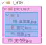{width="0.7920341207349081in" | > . /      | > 同级     | > 引入【怪兽.jpg】： \ /怪兽 .jpg \"\>                       |
|                                                               +------------+------------+-----------------------------------------+
|                                                               |            | > 下一 级  | > 引入【喜羊羊.jpg】： \ /a/喜羊 羊 .jpg \"\>                  |
|                                                               +------------+------------+-----------------------------------------+
|                                                               |            | > 上一 级  | > 引入【奥特曼.jpg】： \ . /奥特曼 .jpg \"\>                   |
+---------------------------------------------------------------+------------+------------+-----------------------------------------+

{width="4.168525809273841e-2in"
height="0.9483497375328084in"}

> 注意点：
>
> 。 相对路径中的 . / 可以省略不写。
>
> 。
> 相对路径依赖的是当前位置，后期若调整了文件位置，那么文件中的路径也要修改。
>
> 2\. **绝对路径**：以**根位置**作为参考点，去建立路径。
>
> 1\. 本地绝对路径： E:/a/b /c/奥特曼 .jpg 。（很少使用）
>
> 2\. 网络绝对路径： <http://www.atguigu.com/images/index_new/logo.png>
> 。

{width="4.168525809273841e-2in"
height="1.1463615485564305in"}

> 注意点：
>
> 。 使用本地绝对路径，
> 一旦更换设备，路径处理起来比较麻烦，所以很少使用。
>
> 。
> 使用网络绝对路径，确实方便，但要注意：若服务器开启了防盗链，会造成图片引入
> 失败。

**3.** **常见图片格式**

> 1\. jpg 格式：

{width="4.168525809273841e-2in"
height="1.3964840332458444in"}

> 概述：扩展名为 .jpg 或 .jpeg
> ，是一种有损的压缩格式（把肉眼不容易观察出来的细节 丢弃了）。
>
> 主要特点： **支持的颜色丰富、占用空间较小**
> 、不支持透明背景、不支持动态图。
>
> 使用场景：对图片细节**没有极高要求**的场景，例如：网站的产品宣传图等
> 。 ------ 该格式网 页中很常见。
>
> 2\. png 格式：

{width="4.168525809273841e-2in"
height="1.1880555555555556in"}

> 概述：扩展名为 .png ，是一种无损的压缩格式，能够更高质量的保存图片。
>
> 主要特点： **支持的颜色丰富**、占用空间略大、 **支持透明背景**
> 、不支持动态图。
>
> 使用场景：①想让图片有透明背景；②想更高质量的呈现图片；例如
> ：公司logo图、重要配 图等。
>
> 3\. bmp 格式：

{width="4.168525809273841e-2in"
height="1.3964840332458444in"}

> 概述：扩展名为 .bmp
> ，不进行压缩的一种格式，在最大程度上保留图片更多的细节。
>
> 主要特点：
> **支持的颜色丰富、保留的细节更多**、占用空间极大、不支持透明背景、不支持动
> 态图。
>
> 使用场景：对图片细节**要求极高**的场景，例如： 一些大型游戏中的图片
> 。（网页中很少使 用）
>
> 4\. gif 格式：

{width="4.168525809273841e-2in"
height="0.9796270778652668in"}

> 概述：扩展名为 .gif ，仅支持256种颜色，色彩呈现不是很完整。
>
> 主要特点：支持的颜色较少、 **支持简单透明背景、支持动态图**。
>
> 使用场景：网页中的动态图片。
>
> 5\. web p 格式：

{width="4.168525809273841e-2in"
height="0.9796150481189851in"}

> 概述：扩展名为 .web p ，谷歌推出的一种格式，专门用来在网页中呈现图片。
>
> 主要特点：具备上述几种格式的优点，但兼容性不太好，
> 一旦使用务必要解决兼容性问题。
>
> 使用场景：网页中的各种图片。
>
> {width="4.168525809273841e-2in"
> height="1.2714162292213473in"}6. base64 格式
>
> 1\. 本质：一串特殊的文本，要通过浏览器打开，传统看图应用通常无法打开。
>
> 2\. 原理：把图片进行 base64 编码，形成一串文本。
>
> 3\. 如何生成：靠一些工具或网站。
>
> 4\. 如何使用：直接作为 img 标签的 src
> 属性的值即可，并且不受文件位置的影响。
>
> 5\. 使用场景： 一些较小的图片，或者需要和网页一起加载的图片。
>
> **图片的格式非常多，上面这些，只是一些常见的、我们前端人员常接触到的。**
>
> **8.** **超链接**

{width="6.17995406824147in"
height="1.0416666666666666e-2in"}

> 主要作用：从当前页面进行跳转。

可以实现：①跳转到指定页面、②跳转到指定文件（也可触发下载）、③跳转到锚点位置、④唤起指定
应用。

+--------------+----------------+-----------------------------------------+------------+
| > **标签名** | > **标签语义** | > **常用属性**                          | > **单**   |
|              |                |                                         | > **/**    |
|              |                |                                         | > **双**   |
|              |                |                                         | > **标签** |
+--------------+----------------+-----------------------------------------+------------+
| > a          | > 超链接       | > href ： 指定要跳转到的具体目标。      | > 双       |
|              |                | >                                       |            |
|              |                | > target ：                             |            |
|              |                | > 控制跳转时如何打开页面，常用值如下:   |            |
|              |                | >                                       |            |
|              |                | > **\_self** ：在本窗口打开。           |            |
|              |                | >                                       |            |
|              |                | > **\_blank** ：在新窗口打开。          |            |
|              |                | >                                       |            |
|              |                | > id ： 元素的唯一                      |            |
|              |                | > 标识，可用于设置锚点。                |            |
|              |                | >                                       |            |
|              |                | > name ： 元素的名字，写在 a            |            |
|              |                | > 标签中，也能设置锚点。                |            |
+--------------+----------------+-----------------------------------------+------------+

> **1.** **跳转到页面**

+-----------------------------------------------------------------------+
| > \< !\-- 跳转其他网页 \--\>                                          |
| >                                                                     |
| > \<a href=\"<https://www.jd.com/>\" target=\"\_blank\"\>去京东\</a\> |
| >                                                                     |
| > \< !\-- 跳转本地网页 \--\>                                          |
| >                                                                     |
| > \<a href= \" . /10_HTML排版标签 .html \" target=                    |
| > \"\_self\"\>去看排版标签\</a\>                                      |
+-----------------------------------------------------------------------+

{width="4.168525809273841e-2in"
height="1.2714293525809275in"}

> 注意点：
>
> 1\. 代码中的**多个空格** 、 **多个回车**，都会被浏览器解析成一个空格！
>
> 2\. 虽然 a 是行内元素，但 a 元素可以包裹除它自身外的任何元素！
> 想展示多个回车或空格，怎么办呢？ ------ 后面会讲。
>
> **2.** **跳转到文件**

+-----------------------------------------------------------------------+
| > \< !\-- 浏览器能直接打开的文件 \--\>                                |
| >                                                                     |
| > \<a href= \" . /resource/自拍 .jpg\"\>看自拍\</a\>                  |
| >                                                                     |
| > \<a href= \" . /resource/小电影 .mp4\"\>看小电影\</a\>              |
| >                                                                     |
| > \<a href= \" . /resource/小姐姐 .gif\"\>看小姐姐\</a\>              |
| >                                                                     |
| > \<a href= \" . /resource/如何一夜暴富 .pdf\"\>点我一夜暴富\</a\>    |
| >                                                                     |
| > \< !\-- 浏览器不能打开的文件，会自动触发下载 \--\>                  |
| >                                                                     |
| > \<a href= \" . /resource/内部资源 .zip\"\>内部资源\</a\>            |
| >                                                                     |
| > \< !\-- 强制触发下载 \--\>                                          |
| >                                                                     |
| > \<a href= \" . /resource/小电影 .mp4 \" download= \" 电影片段       |
| > .mp4\"\>下载电影\</a\>                                              |
+-----------------------------------------------------------------------+

{width="4.168525809273841e-2in"
height="0.739922353455818in"}

> 注意1：若浏览器无法打开文件，则会引导用户下载。
>
> 注意2：若想强制触发下载，请使用 download
> 属性，属性值即为下载文件的名称。
>
> **3.** **跳转到锚点**
>
> 什么是锚点？ ------ 网页中的一个标记点。 具体使用方式：
>
> {width="4.168525809273841e-2in"
> height="4.167979002624672e-2in"} **第一步：设置锚点**

+-----------------------------------------------------------------------+
| > \< !\-- 第一种方式： a标签配合name属性 \--\> \<a name=              |
| > \"test1\"\>\</a\>                                                   |
| >                                                                     |
| > \< !\-- 第二种方式：其他标签配合id属性 \--\> \<h2 id=               |
| > \"test2\"\>我是一个位置\</h2\>                                      |
+-----------------------------------------------------------------------+

{width="4.168525809273841e-2in"
height="0.9691972878390201in"}

> 注意点：
>
> 1\. 具有 href 属性的 a 标签是**超链接**，具有 name 属性的 a
> 标签是**锚点**。
>
> 2\. name 和 id 都是区分大小写的，且 id 最好别是数字开头。
>
> {width="4.168525809273841e-2in"
> height="4.167979002624672e-2in"} **第二步：跳转锚点**

+-----------------------------------------------------------------------+
| > \< !\-- 跳转到test1锚点\--\>                                        |
| >                                                                     |
| > \<a href= \"#test1\"\>去test1锚点\</a\>                             |
| >                                                                     |
| > \< !\-- 跳到本页面顶部 \--\> \<a href= \"# \"\>回到顶部\</a\>       |
| >                                                                     |
| > \< !\-- 跳转到其他页面锚点 \--\>                                    |
| >                                                                     |
| > \<a href= \"demo .html#test1\"\>去demo .html页面的test1锚点\</a\>   |
| >                                                                     |
| > \< !\-- 刷新本页面 \--\>                                            |
| >                                                                     |
| > \<a href= \"\"\>刷新本页面\</a\>                                    |
| >                                                                     |
| > \< !\-- 执行一段js ,如果还不知道执行什么，可以留空，javascript : ;  |
| > \--\> \<a href= \"javascript:alert(1 ) ; \"\>点我弹窗\</a\>         |
+-----------------------------------------------------------------------+

> **4.** **唤起指定应用**
>
> 通过 a 标签，可以唤起设备应用程序。

+-----------------------------------------------------------------------+
| > \< !\-- 唤起设备拨号 \--\>                                          |
| >                                                                     |
| > \<a href= \"tel :10010\"\>电话联系\</a\>                            |
| >                                                                     |
| > \< !\-- 唤起设备发送邮件 \--\>                                      |
| >                                                                     |
| > \<a href= \"mailto:10010@qq.com \"\>邮件联系\</a\> \< !\--          |
| > 唤起设备发送短信 \--\>                                              |
| >                                                                     |
| > \<a href= \"sms:10086\"\>短信联系\</a\>                             |
+-----------------------------------------------------------------------+

> **9.** **列表**

{width="6.17995406824147in"
height="1.0416666666666666e-2in"}

> **1.** **有序列表**
>
> 概念：有顺序或侧重顺序的列表。

+-----------------------------------------------------------------------+
| > \<h2\>要把大象放冰箱总共分几步\</h2\> \<ol\>                        |
| >                                                                     |
| > \<li\>把冰箱门打开\</li\> \<li\>把大象放进去\</li\>                 |
| >                                                                     |
| > \<li\>把冰箱门关上\</li\> \< /ol\>                                  |
+-----------------------------------------------------------------------+

> **2.** **无序列表**
>
> 概念：无顺序或不侧重顺序的列表。

+-----------------------------------------------------------------------+
| > \<h2\>我想去的几个城市\</h2\> \<ul\>                                |
| >                                                                     |
| > \<li\>成都\</li\>                                                   |
| >                                                                     |
| > \<li\>上海\</li\>                                                   |
| >                                                                     |
| > \<li\>西安\</li\>                                                   |
| >                                                                     |
| > \<li\>武汉\</li\> \< /ul\>                                          |
+-----------------------------------------------------------------------+

> **3.** **列表嵌套**
>
> 概念：列表中的某项内容，又包含一个列表（注意：嵌套时，请务必把解构写完整）。
>
> **4.** **自定义列表**
>
> 1\.
> 概念：所谓自定义列表，就是一个包含**术语名称**以及**术语描述**的列表。
>
> 2\. 一个 dl 就是一个自定义列表， 一个 dt 就是一个术语名称， 一个 dd
> 就是术语描述（可以有多 个）。

+-----------------------------------------------------------------------+
| > \<h2\>如何高效的学习？\< /h2\> \<dl\>                               |
| >                                                                     |
| > \<dt\>做好笔记\</dt\>                                               |
| >                                                                     |
| > \<dd\>笔记是我们以后复习的一个抓手\</dd\>                           |
| >                                                                     |
| > \<dd\>笔记可以是电子版，也可以是纸质版\</dd\> \<dt\>多加练习\</dt\> |
| >                                                                     |
| > \<dd\>只有敲出来的代码，才是自己的\</dd\> \<dt\>别怕出错\</dt\>     |
| >                                                                     |
| > \<dd\>错很正常，改正后并记住，就是经验\</dd\> \< /dl\>              |
+-----------------------------------------------------------------------+

> **10.** **表格**

{width="6.17995406824147in"
height="1.042979002624672e-2in"}

> **1.** **基本结构**
>
> 1\. 一个完整的表格由： **表格标题** 、 **表格头部** 、 **表格主体** 、
> **表格脚注**，四部分组成。

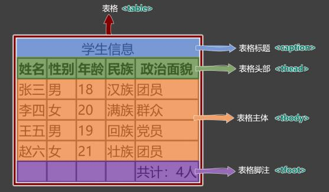{width="5.7943580489938755in"
height="3.3869903762029745in"}

> 2\. 表格涉及到的标签： table ：表格
>
> caption ：表格标题
>
> thead ：表格头部
>
> tbody ：表格主体
>
> tfoot ：表格注脚
>
> tr ：每一行
>
> th 、 td ：每一个单元格（备注：表格头部中用 th
> ，表格主体、表格脚注中用： td ）

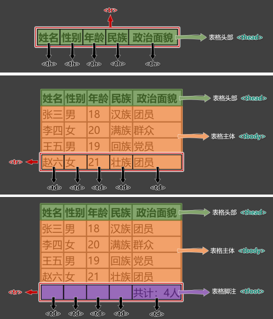{width="5.794359142607174in"
height="6.773973097112861in"}

3\. 具体编码：

> \<table border= \"1 \"\>
>
> \< !\-- 表格标题 \--\>
>
> \<caption\>学生信息\</caption\>
>
> \< !\-- 表格头部 \--\>
>
> \<thead\>
>
> \<tr\>
>
> \<th\>姓名\</th\>
>
> \<th\>性别\</th\>
>
> \<th\>年龄\</th\>
>
> \<th\>民族\</th\>
>
> \<th\>政治面貌\</th\> \< /tr\>
>
> \< /thead\>

**2.** **常用属性**

+--------------+----------------+--------------------------------------------------+---------------+
| > **标签名** | > **标签语义** | > **常用属性**                                   | > **单/双标** |
|              |                |                                                  | > **签**      |
+--------------+----------------+--------------------------------------------------+---------------+
|              | > 表格         | > width ：设置表格宽度。                         | > 双          |
|              |                | >                                                |               |
|              |                | > height                                         |               |
|              |                | > ：设置表格**最小**高度，表格最终高度可能比设置 |               |
|              |                | > 的值大。                                       |               |
|              |                | >                                                |               |
|              |                | > border ：设置表格边框宽度。                    |               |
|              |                | >                                                |               |
|              |                | > cellspacing ： 设置单元格之间的间距。          |               |
+--------------+----------------+--------------------------------------------------+---------------+
| > thead      | > 表格头部     | > height ：设置表格头部高度。                    | > 双          |
|              |                | >                                                |               |
|              |                | > align ：                                       |               |
|              |                | > 设置单元格的**水平**对齐方式，可选值如下：     |               |
|              |                | >                                                |               |
|              |                | > 1\. left ：左对齐                              |               |
|              |                | >                                                |               |
|              |                | > 2\. center ：中间对齐                          |               |
|              |                | >                                                |               |
|              |                | > 3\. right ：右对齐                             |               |
|              |                | >                                                |               |
|              |                | > valign                                         |               |
|              |                | > ：设置单元格的**垂直**对齐方式，可选值如下：   |               |
|              |                | >                                                |               |
|              |                | > 1\. top ：顶部对齐                             |               |
|              |                | >                                                |               |
|              |                | > 2\. middle ：中间对齐                          |               |
|              |                | >                                                |               |
|              |                | > 3\. bottom ：底部对齐                          |               |
+--------------+----------------+--------------------------------------------------+---------------+
| > tbody      | > 表格主体     | > 常用属性与 thead 相同。                        | > 双          |
+--------------+----------------+--------------------------------------------------+---------------+
| > tr         | > 行           | > 常用属性与 thead 相同。                        | > 双          |
+--------------+----------------+--------------------------------------------------+---------------+
| > tfoot      | > 表格脚注     | > 常用属性与 thead 相同。                        | > 双          |
+--------------+----------------+--------------------------------------------------+---------------+
| > td         | > 普通单元     | > width                                          | > 双          |
|              | >              | > ：设置单元格的宽度，同列所有单元格全都受影     |               |
|              | > 格           | > 响。                                           |               |
|              |                | >                                                |               |
|              |                | > heigth                                         |               |
|              |                | > ：设置单元格的高度，同行所有单元格全都受影     |               |
|              |                | > 响。                                           |               |
|              |                | >                                                |               |
|              |                | > align ：设置单元格的水平对齐方式。             |               |
|              |                | >                                                |               |
|              |                | > valign ：设置单元格的垂直对齐方式。            |               |
|              |                | >                                                |               |
|              |                | > rowspan ：指定要跨的行数。                     |               |
|              |                | >                                                |               |
|              |                | > colspan ：指定要跨的列数。                     |               |
+--------------+----------------+--------------------------------------------------+---------------+
|              | > 表头单元 格  | > 常用属性与 td 相同。                           | > 双          |
+--------------+----------------+--------------------------------------------------+---------------+

> {width="4.168525809273841e-2in"
> height="1.8342005686789151in"}注意点：
>
> 1\. \<table\> 元素的 border 属性可以控制表格边框，但 border
> 值的大小，并不控制单元格 边框的宽度，
>
> 只能控制表格最外侧边框的宽度，这个问题如何解决？ ------ 后期靠 CSS
> 控制。
>
> 2\. 默认情况下，每列的宽度，得看这一列单元格最长的那个文字。
>
> 3\. 给某个 th 或 td 设置了宽度之后，他们所在的那一列的宽度就确定了。
>
> 4\. 给某个 th 或 td 设置了高度之后，他们所在的那一行的高度就确定了。
>
> **3.** **跨行跨列**
>
> 1\. rowspan ：指定要跨的行数。
>
> 2\. colspan ：指定要跨的列数。 课程表效果：

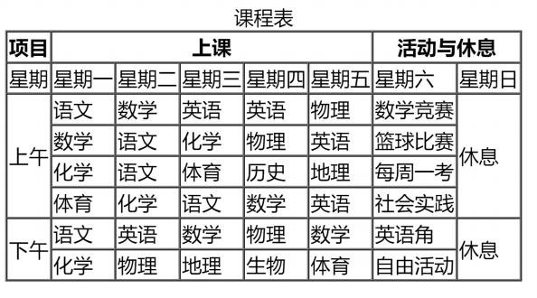{width="6.17995406824147in"
height="3.428675634295713in"}

> 编写思路：

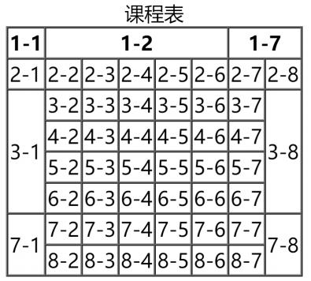{width="4.106073928258968in"
height="3.699634733158355in"}

> **11.常用标签补充**

+--------------+----------------------------------------------+-------------+
| > **标签名** | > **标签含义**                               | > **单**    |
|              |                                              | > **/**     |
|              |                                              | > **双**    |
|              |                                              | > **标签**  |
+--------------+----------------------------------------------+-------------+
|              | > 换行                                       | > 单        |
+--------------+----------------------------------------------+-------------+
|              | > 分隔                                       | > 单        |
+--------------+----------------------------------------------+-------------+
|              | > 按原文显示（一般用于在页面中嵌入大段代码） | > 双        |
+--------------+----------------------------------------------+-------------+

{width="4.168525809273841e-2in"
height="1.177652012248469in"}

> 注意点：
>
> 1\. 不要用 \<br\> 来增加文本之间的行间隔，应使用 \<p\>
> 元素，或后面即将学到的 CSS margin 属性。
>
> 2\. \<hr\>
> 的语义是分隔，如果不想要语义，只是想画一条水平线，那么应当使用 CSS
> 完成。
>
> **12.** **表单**

{width="6.17995406824147in"
height="1.0416666666666666e-2in"}

> 概念：一个包含交互的区域，用于收集用户提供的数据。
>
> **1.** **基本结构**
>
> 简单梳理：

+--------------+------------+------------------------------------------------------+-------------+
| > **标签名** | > **标签** | > **常用属性**                                       | > **单/双** |
|              | >          |                                                      | > **标签**  |
|              | > **语义** |                                                      |             |
+--------------+------------+------------------------------------------------------+-------------+
| > form       | > 表单     | > action                                             | > 双        |
|              |            | > ：用于指定表单的提交地址（需要与后端人员沟通后确   |             |
|              |            | > 定）。                                             |             |
|              |            | >                                                    |             |
|              |            | > target                                             |             |
|              |            | > ：用于控制表单提交后，如何打开页面，常用值如下：   |             |
|              |            | >                                                    |             |
|              |            | > \_self ：在本窗口打开。                            |             |
|              |            | >                                                    |             |
|              |            | > \_blank ：在新窗口打开。                           |             |
|              |            | >                                                    |             |
|              |            | > method                                             |             |
|              |            | > ：用于控制表单的提交方式，暂时只需了解，在后面     |             |
|              |            | > Ajax 的课程中，会详细讲解。                        |             |
+--------------+------------+------------------------------------------------------+-------------+
|              | > 输入 框  | > type ：设置输入框的类型，目前用到的值是 text       | > 单        |
|              |            | > ，表示普通 文本。                                  |             |
|              |            | >                                                    |             |
|              |            | > name                                               |             |
|              |            | > ：用于指定提交数据的名字，（需要与后端人员沟通后确 |             |
|              |            | > 定）。                                             |             |
+--------------+------------+------------------------------------------------------+-------------+
| > button     | > 按钮     | > 本小节暂不涉及                                     | > 双        |
+--------------+------------+------------------------------------------------------+-------------+

> 在本小节，我们先记住表单的整体形式，稍后会对表单控件进行详细讲解。
>
> 示例代码：

+-----------------------------------------------------------------------+
| > \<form action=\"<https://www.baidu.com/s>\" target=\"\_blank\"      |
| > method=\"get\"\> \<input type= \"text \" name= \"wd \"\>            |
| >                                                                     |
| > \<button\>去百度搜索\</button\> \< /form\>                          |
+-----------------------------------------------------------------------+

> **2.** **常用表单控件**
>
> **①** **文本输入框**

+-----------------------------------------------------------------------+
| > \<input type= \"text \"\>                                           |
+-----------------------------------------------------------------------+

{width="4.168525809273841e-2in"
height="1.3964840332458444in"}

> 常用属性如下：
>
> name 属性：数据的名称。
>
> value 属性：输入框的默认输入值。
>
> maxlength 属性：输入框最大可输入长度。
>
> **②** **密码输入框**

+-----------------------------------------------------------------------+
| > \<input type= \"password \"\>                                       |
+-----------------------------------------------------------------------+

{width="4.168525809273841e-2in"
height="1.3964840332458444in"}

> 常用属性如下：
>
> name 属性：数据的名称。
>
> value 属性：输入框的默认输入值（一般不用，无意义）。
>
> maxlength 属性：输入框最大可输入长度。
>
> **③** **单选框**

+-----------------------------------------------------------------------+
| > \<input type= \" radio \" name= \"sex \" value= \"female \"\>女     |
| >                                                                     |
| > \<input type= \" radio \" name= \"sex \" value= \"male \"\>男       |
+-----------------------------------------------------------------------+

{width="4.168525809273841e-2in"
height="1.3964840332458444in"}

> 常用属性如下：
>
> name 属性：数据的名称，注意：想要单选效果，多个 radio 的 name
> 属性值要保持一致。
>
> value 属性：提交的数据值。
>
> checked 属性：让该单选按钮默认选中。
>
> **④** **复选框**

+-----------------------------------------------------------------------+
| > \<input type= \"checkbox \" name= \"hobby \" value= \"smoke         |
| > \"\>抽烟                                                            |
| >                                                                     |
| > \<input type= \"checkbox \" name= \"hobby \" value= \"drink\"\>喝酒 |
| >                                                                     |
| > \<input type= \"checkbox \" name= \"hobby \" value= \"perm\"\>烫头  |
+-----------------------------------------------------------------------+

{width="4.168525809273841e-2in"
height="1.3964840332458444in"}

> 常用属性如下：：
>
> name 属性：数据的名称。
>
> value 属性：提交的数据值。
>
> checked 属性：让该复选框默认选中。
>
> **⑤** **隐藏域**

+-----------------------------------------------------------------------+
| > \<input type= \"hidden \" name= \"tag \" value= \"100 \"\>          |
+-----------------------------------------------------------------------+

{width="4.168525809273841e-2in"
height="0.8545461504811899in"}

> 用户不可见的一个输入区域，作用是：
> 提交表单的时候，携带一些固定的数据。 name 属性：指定数据的名称。
>
> value 属性：指定的是真正提交的数据。
>
> **⑥** **提交按钮**

+-----------------------------------------------------------------------+
| > \<input type= \"submit \" value= \"点我提交表单 \"\>                |
| > \<button\>点我提交表单\</button\>                                   |
+-----------------------------------------------------------------------+

{width="4.168525809273841e-2in"
height="1.1880424321959755in"}

> 注意：
>
> 1\. button 标签 type 属性的默认值是 submit 。
>
> 2\. button 不要指定 name 属性
>
> 3\. input 标签编写的按钮，使用 value 属性指定按钮文字。
>
> **⑦** **重置按钮**

+-----------------------------------------------------------------------+
| > \<input type= \" reset \" value= \"点我重置 \"\> \<button type= \"  |
| > reset\"\>点我重置\</button\>                                        |
+-----------------------------------------------------------------------+

{width="4.168525809273841e-2in"
height="0.9587937445319336in"}

> 注意点：
>
> 1\. button 不要指定 name 属性
>
> 2\. input 标签编写的按钮，使用 value 属性指定按钮文字。
>
> **⑧** **普通按钮**

+-----------------------------------------------------------------------+
| > \<input type= \"button \" value= \"普通按钮 \"\> \<button type=     |
| > \"button\"\>普通按钮\</button\>                                     |
+-----------------------------------------------------------------------+

{width="4.168525809273841e-2in"
height="0.42727252843394575in"} 注意点：普通按钮的 type 值为 button
，若不写 type 值是 submit 会引起表单的提交。

> **⑨文本域**

+-----------------------------------------------------------------------+
| > \<textarea name= \"msg \" rows= \"22 \" cols= \"3                   |
| > \"\>我是文本域\</textarea\>                                         |
+-----------------------------------------------------------------------+

{width="4.168525809273841e-2in"
height="1.1776257655293088in"}

> 常用属性如下：
>
> 1\. rows 属性：指定默认显示的行数，会影响文本域的高度。
>
> 2\. cols 属性：指定默认显示的列数，会影响文本域的宽度。
>
> 3\. 不能编写 type 属性，其他属性，与普通文本输入框一致。
>
> **⑩** **下拉框**

+--------------------------------------------------------------------------+
| > \<select name= \"from \"\>                                             |
|                                                                          |
| +-----------------+----------------------------------------------------+ |
| | > \<option      | > value= \"黑 \"\>黑龙江\</option\>                | |
| +-----------------+----------------------------------------------------+ |
| | > \<option      | > value= \"辽 \"\>辽宁\</option\>                  | |
| +-----------------+----------------------------------------------------+ |
| | > \<option      | > value= \"吉 \"\>吉林\</option\>                  | |
| +-----------------+----------------------------------------------------+ |
| | > \<option      | value= \"粤 \" selected\>广东\</option\>           | |
| +-----------------+----------------------------------------------------+ |
| | \< /select\>    |                                                    | |
| +-----------------+----------------------------------------------------+ |
+--------------------------------------------------------------------------+

{width="4.168525809273841e-2in"
height="1.4069006999125109in"}

> 常用属性及注意事项：
>
> 1\. name 属性：指定数据的名称。
>
> 2\. option 标签设置 value 属性， 如果没有 value 属性，提交的数据是
> option 中间的文 字；如果设置了 value 属性，提交的数据就是 value
> 的值（建议设置 value 属性）
>
> 3\. option 标签设置了 selected 属性，表示默认选中。
>
> **3.** **禁用表单控件**
>
> 给表单控件的标签设置 disabled 既可禁用表单控件。
>
> **4.label** **标签**
>
> label
> 标签可与表单控件相关联，关联之后点击文字，与之对应的表单控件就会获取焦点。
> 两种与 label 关联方式如下：
>
> 1\. 让 label 标签的 for 属性的值等于表单控件的 id 。
>
> 2\. 把表单控件套在 label 标签的里面。
>
> **5.** **fieldset** **与** **legend** **的使用（了解）**

fieldset 可以为表单控件分组、 legend 标签是分组的标题。

> 示例：

+-----------------------------------------------------------------------+
| > \<fieldset\>                                                        |
| >                                                                     |
| > \<legend\>主要信息\</legend\>                                       |
| >                                                                     |
| > \<label for= \"zhanghu \"\>账户： \< /label\>                       |
| >                                                                     |
| > \<input id= \"zhanghu \" type= \"text \" name= \"account \"         |
| > maxlength= \"10\"\>\<br\> \<label\>                                 |
| >                                                                     |
| > 密码：                                                              |
| >                                                                     |
| > \<input id= \"mima \" type= \"password \" name= \"pwd \" maxlength= |
| > \"6 \"\> \< /label\>                                                |
| >                                                                     |
| > \<br\>                                                              |
| >                                                                     |
| > 性别：                                                              |
| >                                                                     |
| > \<input type= \" radio \" name= \"gender \" value= \"male \" id=    |
| > \"nan \"\>                                                          |
| >                                                                     |
| > \<label for= \"nan \"\>男\</label\>                                 |
| >                                                                     |
| > \<label\>                                                           |
| >                                                                     |
| > \<input type= \" radio \" name= \"gender \" value= \"female \" id=  |
| > \"nv \"\>女                                                         |
| >                                                                     |
| > \< /label\> \< /fieldset\>                                          |
+-----------------------------------------------------------------------+

> **6.** **表单总结**

+--------------+----------+------------------------------------------------------+
| > **标签名** | > **标** | > **常用属性**                                       |
|              | > **签** |                                                      |
|              | > **语** |                                                      |
|              | > **义** |                                                      |
+--------------+----------+------------------------------------------------------+
|              | > 表 单  | > action 属性： 表单要提交的地址。                   |
|              |          | >                                                    |
|              |          | > target 属性： 要跳转的新地址打开位置; 值: \_self   |
|              |          | > 、 \_blank                                         |
|              |          | >                                                    |
|              |          | > method 属性： 请求方式，值： get 、 post           |
+--------------+----------+------------------------------------------------------+
|              | > 多 种  | > type 属性： 指定表单控件的类型。                   |
|              | > 形 式  | >                                                    |
|              | > 的 表  | > 值： text 、 password 、 radio 、 checkbox 、      |
|              | > 单 控  | > hidden 、 submit 、 res button 等。                |
|              | > 件     | >                                                    |
|              |          | > name 属性： 指定数据名称 value 属性：              |
|              |          | >                                                    |
|              |          | > 对于输入框：指定默认输入的值；                     |
|              |          | >                                                    |
|              |          | > 对于单选和复选框：实际提交的数据；                 |
|              |          | >                                                    |
|              |          | > 对于按钮：显示按钮文字。                           |
|              |          | >                                                    |
|              |          | > disabled 属性： 设置表单控件不可用。               |
|              |          | >                                                    |
|              |          | > maxlength 属性： 用于输入框，设置最大可输入长度。  |
|              |          | >                                                    |
|              |          | > checked 属性： 用于单选按钮和复选框，默认选中      |
+--------------+----------+------------------------------------------------------+
|              | > 文 本  | > name 属性： 指定数据名称                           |
|              | > 域     | >                                                    |
|              |          | > rows 属性： 指定默认显示的行数，影响文本域的高度。 |
|              |          | >                                                    |
|              |          | > cols 属性： 指定默认显示的列数，影响文本域的宽度。 |
|              |          | >                                                    |
|              |          | > disabled 属性： 设置表单控件不可用。               |
+--------------+----------+------------------------------------------------------+
| > select     | > 下 拉  | > name 属性： 指定数据名称                           |
|              | > 框     | >                                                    |
|              |          | > disabled 属性： 设置整个下拉框不可用。             |
+--------------+----------+------------------------------------------------------+
| > option     | > 下 拉  | > disabled 属性： 设置拉下选项不可用。               |
|              | > 框 的  | >                                                    |
|              | > 选 项  | > value 属性： 该选项事件提交的数据                  |
|              |          | >                                                    |
|              |          | > （不指定value，会把标签中的内容作为提交数据）      |
|              |          | > selected 属性： 默认选中。                         |
+--------------+----------+------------------------------------------------------+
| > button     | > 按 钮  | > disabled 属性： 设置按钮不可用。                   |
|              |          | >                                                    |
|              |          | > type 属性： 设置按钮的类型，值： submit （默认）、 |
|              |          | > reset 、 button                                    |
+--------------+----------+------------------------------------------------------+
|              | > 与 表  | > for 属性： 值与要关联的表单控件的ID值相同。        |
|              | > 单 控  |                                                      |
|              | > 件 做  |                                                      |
|              | > 关 联  |                                                      |
+--------------+----------+------------------------------------------------------+
| > fieldset   | > 表 单  |                                                      |
|              | > 边 框  |                                                      |
+--------------+----------+------------------------------------------------------+

{width="6.17995406824147in"
height="0.11463910761154855in"}

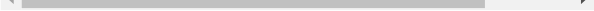{width="6.17995406824147in"
height="0.10421259842519685in"}

> {width="6.17995406824147in"
> height="1.0416666666666666e-2in"}**13.框架标签**

+--------------+--------------------------+------------------------------+------------+
| > **标签名** | > **功能和语义**         | > **属性**                   | > **单**   |
|              |                          |                              | > **/**    |
|              |                          |                              | > **双标** |
|              |                          |                              | >          |
|              |                          |                              | > **签**   |
+--------------+--------------------------+------------------------------+------------+
| > iframe     | > 框架（在网页中嵌入其他 | > name ：框架名字，可以与    | > 双       |
|              | > 文件）                 | > target 属 性配合。         |            |
|              |                          | >                            |            |
|              |                          | > width ： 框架的宽。        |            |
|              |                          | >                            |            |
|              |                          | > height ： 框架的高度。     |            |
|              |                          | >                            |            |
|              |                          | > frameborder                |            |
|              |                          | > ：是否显示边框，值： 0     |            |
|              |                          | > 或者1。                    |            |
+--------------+--------------------------+------------------------------+------------+

{width="4.168525809273841e-2in"
height="0.9587664041994751in"}

> iframe 标签的实际应用：
>
> 1\. 在网页中嵌入广告。
>
> 2\. 与超链接或表单的 target 配合，展示不同的内容。
>
> **14.HTML实体**

{width="6.17995406824147in"
height="1.0416666666666666e-2in"}

> {width="4.168525809273841e-2in"
> height="0.6461307961504812in"}在 HTML
> 中我们可以用一种**特殊的形式**的内容，来表示某个**符号**，这种特殊形式的内容，就是
> HTML 实 体。比如小于号 \< 用于定义 HTML
> 标签的开始。如果我们希望浏览器正确地显示这些字符，我们必须 在 HTML
> 源码中插入字符实体。
>
> **字符实体**由三部分组成： 一个 & 和 一个实体名称（或者一个 \# 和
> 一个实体编号），最后加上一 个分号 ; 。
>
> 常见字符实体总结：

+----------+--------------------------+------------------+----------------+
|          | > **描述**               | > **实体名称**   | > **实体编号** |
+----------+--------------------------+------------------+----------------+
|          | > **空格**               |                  | > **&#160;**   |
+----------+--------------------------+------------------+----------------+
| > **\<** | > **小于号**             |                  | > **&#60;**    |
+----------+--------------------------+------------------+----------------+
| > **\>** | > **大于号**             |                  | > **&#62;**    |
+----------+--------------------------+------------------+----------------+
| > **&**  | > **和号**               |                  | > **&#38;**    |
+----------+--------------------------+------------------+----------------+
| > \"     | > 引号                   | > &quot ;        | > &#34;        |
+----------+--------------------------+------------------+----------------+
| > ´      | > 反引号                 | > &acute ;       | > &#180;       |
+----------+--------------------------+------------------+----------------+
| > ￠     | > 分（ cent）            | > &cent ;        | > &#162;       |
+----------+--------------------------+------------------+----------------+
| > £      | > 镑（pound）            | > &pound ;       | > &#163;       |
+----------+--------------------------+------------------+----------------+
| > **¥**  | > **元（yen）**          |                  | > **&#165;**   |
+----------+--------------------------+------------------+----------------+
| > €      | > 欧元（ euro）          | > &euro ;        | > &#8364;      |
+----------+--------------------------+------------------+----------------+
| > **©**  | > **版权（copyright）**  |                  | > **&#169;**   |
+----------+--------------------------+------------------+----------------+
| > ®      | > 注册商标               | > &reg ;         | > &#174;       |
+----------+--------------------------+------------------+----------------+
| > ™      | > 商标                   | > &trade ;       | > &#8482;      |
+----------+--------------------------+------------------+----------------+
| > **×**  | > **乘号**               |                  | > **&#215;**   |
+----------+--------------------------+------------------+----------------+
| > **÷**  | > **除号**               |                  | > **&#247;**   |
+----------+--------------------------+------------------+----------------+

> 完整实体列表，请参考： [**HTML** **Standard**
> **(whatwg.org)**](https://html.spec.whatwg.org/multipage/named-characters.html#named-character-references)
>
> **15.HTML全局属性**

{width="6.17995406824147in"
height="1.0416666666666666e-2in"}

> 常用的全局属性：

+--------------+--------------------------------------------------------------+
| > **属性名** | > **含义**                                                   |
+--------------+--------------------------------------------------------------+
|              | > 给标签指定唯一标识，注意： id 是不能重复的。               |
|              | >                                                            |
|              | > 作用：可以让 label 标签与表单控件相关联；也可以与 CSS 、   |
|              | > JavaScript 配合使 用，。                                   |
+--------------+--------------------------------------------------------------+
| > class      | > 给标签指定类名，随后通过 CSS 就可以给标签设置样式。        |
+--------------+--------------------------------------------------------------+
| > style      | > 给标签设置 CSS 样式。                                      |
+--------------+--------------------------------------------------------------+
|              | > 内容的方向，值: ltr 、 rtl                                 |
+--------------+--------------------------------------------------------------+
| > title      | > 给标签设置一个文字提示， 一般超链接和图片用得比较多。      |
+--------------+--------------------------------------------------------------+
| > lang       | > 给标签指定语言，具体规范和可选值请参考【10. HTML           |
|              | > 设置语言】。                                               |
+--------------+--------------------------------------------------------------+

> 完整的全局属性，请参考： [**全局属性** **-**
> **HTML（超文本标记语言）** **\|** **MDN**
> **(mozilla.org)**](https://developer.mozilla.org/zh-CN/docs/Web/HTML/Global_attributes)
>
> {width="6.17995406824147in"
> height="1.0416666666666666e-2in"}**16.meta** **元信息**
>
> 1\. 配置字符编码

+-----------------------------------------------------------------------+
| > \<meta charset= \"utf-8 \"\>                                        |
+-----------------------------------------------------------------------+

> 2\. 针对 IE 浏览器的兼容性配置。

+-----------------------------------------------------------------------+
| > \<meta [http-equiv=](http-equiv=)\"X-UA-Compatible\"                |
| > content=\"IE=edge\"\>                                               |
+-----------------------------------------------------------------------+

> 3\. 针对移动端的配置（移动端课程中会详细讲解）

+-----------------------------------------------------------------------+
| > \<meta name= \"viewport \" content= \"width=device-width ,          |
| > initial-scale=1 .0 \"\>                                             |
+-----------------------------------------------------------------------+

> 4\. 配置网页关键字

+-----------------------------------------------------------------------+
| > \<meta name= \"keywords \" content=                                 |
| > \"8-12个以英文逗号隔开的单词/词语 \"\>                              |
+-----------------------------------------------------------------------+

> 5\. 配置网页描述信息

+-----------------------------------------------------------------------+
| > \<meta name= \"description \" content=                              |
| > \"80字以内的一段话，与网站内容相关 \"\>                             |
+-----------------------------------------------------------------------+

> 6\. 针对搜索引擎爬虫配置：

+------------------------------------------------------------------------------------------+
| +-----------------------------------------------------------------------+                |
| | > \<meta name= \" robots \" content= \"此处可选值见下表 \"\>          |                |
| +-----------------------------------------------------------------------+                |
+---------------------------------------+--------------------------------------------------+
| > **值**                              | > **描述**                                       |
+---------------------------------------+--------------------------------------------------+
| > index                               | > 允许搜索爬虫索引此页面。                       |
+---------------------------------------+--------------------------------------------------+
| > noindex                             | > 要求搜索爬虫不索引此页面。                     |
+---------------------------------------+--------------------------------------------------+
| > follow                              | > 允许搜索爬虫跟随此页面上的链接。               |
+---------------------------------------+--------------------------------------------------+
| > nofollow                            | > 要求搜索爬虫不跟随此页面上的链接。             |
+---------------------------------------+--------------------------------------------------+
| > all                                 | > 与 index , follow 等价                         |
+---------------------------------------+--------------------------------------------------+
| > none                                | > 与 noindex , nofollow 等价                     |
+---------------------------------------+--------------------------------------------------+
| > noarchive                           | > 要求搜索引擎不缓存页面内容。                   |
+---------------------------------------+--------------------------------------------------+
| > nocache                             | > noarchive 的替代名称。                         |
+---------------------------------------+--------------------------------------------------+

> 7\. 配置网页作者：

+-----------------------------------------------------------------------+
| > \<meta name= \"author \" content= \"tony \"\>                       |
+-----------------------------------------------------------------------+

> 8\. 配置网页生成工具

+-----------------------------------------------------------------------+
| > \<meta name= \"generator \" content= \"Visual Studio Code \"\>      |
+-----------------------------------------------------------------------+

> 9\. 配置定义网页版权信息：

+-----------------------------------------------------------------------+
| > \<meta name= \"copyright \" content= \"2023-2027©版权所有 \"\>      |
+-----------------------------------------------------------------------+

+-----------------------------------------------------------------------+
| > \<meta [http-equiv=](http-equiv=)\"refresh\"                        |
| > content=\"10;url=<http://www.baidu.com>\"\>                         |
+-----------------------------------------------------------------------+

> 完整的网页元信息，请参考： [**文档级元数据元素** **\|**
> **MDN**](https://developer.mozilla.org/zh-CN/docs/Web/HTML/Element/meta)
>
> {width="6.17995406824147in"
> height="1.0416666666666666e-2in"}**17.** **HTML总结**

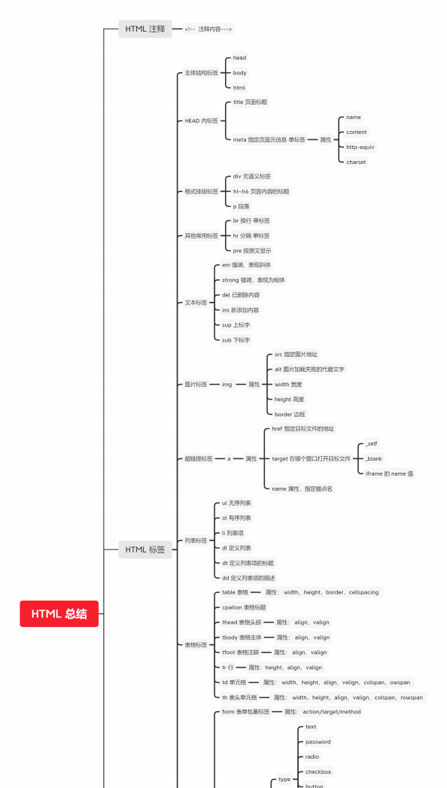{width="6.17995406824147in"
height="10.90090769903762in"}

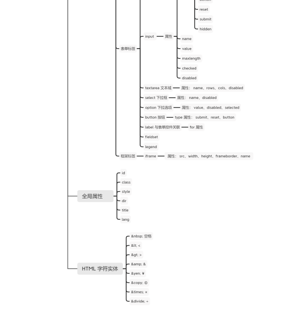{width="6.17995406824147in"
height="6.732281277340332in"}
