<h2>记录学习Vue之路</h2>

禹神四件套，各个No1，B站天花板！

1、**前端基础** : [尚硅谷前端入门html+css零基础教程，零基础前端开发html5+css3视频](https://www.bilibili.com/video/BV1p84y1P7Z5/?spm_id_from=333.788.comment.all.click&vd_source=0aba82a4002c00e3a072b82df5f53868)

2、Vue3.0: [尚硅谷Vue3入门到实战，最新版vue3+TypeScript前端开发教程](https://www.bilibili.com/video/BV1Za4y1r7KE/?spm_id_from=333.788.comment.all.click&vd_source=0aba82a4002c00e3a072b82df5f53868)

3、Vue全家桶(当前学习): [尚硅谷Vue2.0+Vue3.0全套教程丨vuejs从入门到精通](
https://www.bilibili.com/video/BV1Zy4y1K7SH/?p=6&spm_id_from=pageDriver&vd_source=0aba82a4002c00e3a072b82df5f53868)

4、React: [尚硅谷React教程（已加更新版内容，B站最火）](https://www.bilibili.com/video/BV1wy4y1D7JT/?spm_id_from=333.788.comment.all.click&vd_source=0aba82a4002c00e3a072b82df5f53868)


```
温馨提示: 此readme.md文件,是禹神所讲笔记中PDF文件通过WPS转成word文件,再由word通过pandoc工具转成markdown格式文件,故存在错误，请见谅。具体内容可看课件文件夹里面的内容。
```

<iframe src="https://github.com/KennyHito/WebBasic/blob/main/%E7%AC%94%E8%AE%B0/HTML4%E7%AC%94%E8%AE%B0.pdf" style="width:600px; height:500px;" frameborder="0">
    Loading PDF...
</iframe>

> **一、** **前序知识**
>
> **1.** **认识两位先驱**


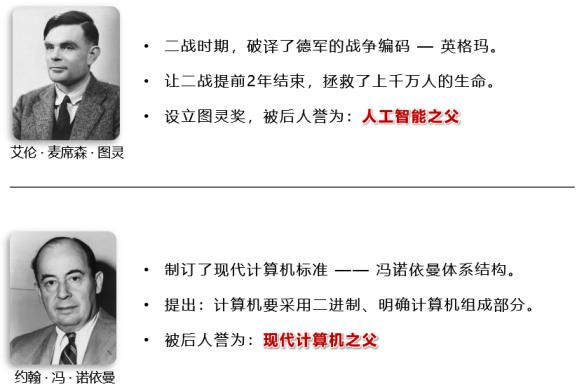

> **2.**
> **计算机基础知识**
>
> 1\.
> **计算机**俗称电脑，是现代一种用于高速计算的电子计算机器，可以进行数值计算、逻辑计算，还
> 具有存储记忆功能。
>
> 2\. 计算机由 **硬件** + **软件** 成：
>
> 。 硬件：看得见摸得着的物理部件。
>
> 。 软件：可以指挥硬件工作的指令。
>
> 3\. 软件的分类：
>
> 1\. 系统软件： Windows、 Linux、Android、 Harmony 等。
>
> 2\. 应用软件：微信、 QQ、王者荣耀、 PhotoShop 等。
>
> 4\. 整体图示：

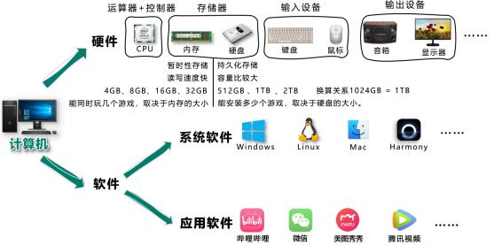

> **3.** **C/S架构与B/S架构**

<table>
<colgroup>
<col style="width: 6%" />
<col style="width: 58%" />
<col style="width: 35%" />
</colgroup>
<tbody>
<tr>
<td colspan="3"><blockquote>
<p>1. 上面提到的应用软件，又分为两大类：</p>
<p>。
<strong>C/S架构</strong>，特点：需要安装、偶尔更新、不跨平台、开发更具针对性。
。
<strong>B/S架构</strong>，特点：无需安装、无需更新、可跨平台、开发更具通用性。</p>
</blockquote></td>
</tr>
<tr>
<td></td>
<td colspan="2"><blockquote>
<p>名词解释： C =&gt; client（客户端）、 B =&gt; browser（浏览器）、 S
=&gt; server（服务器）。</p>
<p>服务器 ：为软件提供数据的设备（在背后默默的付出）。</p>
</blockquote></td>
</tr>
<tr>
<td colspan="3"><blockquote>
<p>2. <strong>前端工程师，主要负责编写</strong>
<strong>B/S架构中的网页（呈现界面、实现交互）</strong> 。</p>
</blockquote></td>
</tr>
<tr>
<td></td>
<td colspan="2"><blockquote>
<p>备注：大前端时代，我们可以用前端的技术栈，做出一个C/S架构的应用、甚至搭建一个服
务器囤。</p>
</blockquote></td>
</tr>
<tr>
<td colspan="2"><blockquote>
<p><strong>4.</strong> <strong>浏览器相关知识</strong></p>
</blockquote></td>
<td></td>
</tr>
</tbody>
</table>

> 浏览器是网页运行的平台，常见的浏览器有： 谷歌(Chrome) 、 Safari 、 IE
> 、 火狐(Firefox) 、 欧 朋(Opera) 等，以上这些是常用的五大浏览器。
>
> **1.各大浏览器市场份额：**

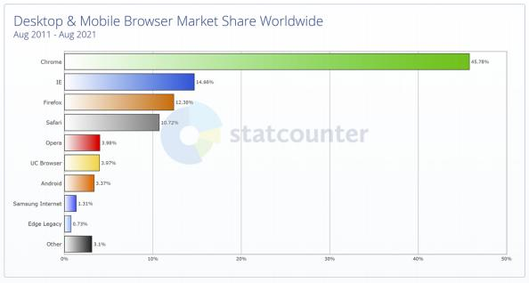

> **2.常见浏览器的内核：**

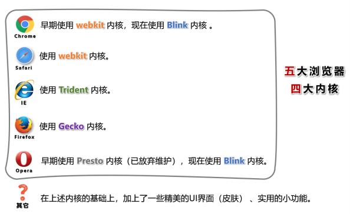

> **5.**
> **网页相关概念**
>
> 1\. 网址：我们在浏览器中输入的地址。
>
> 2\. 网页：浏览器所呈现的每一个页面。
>
> 3\. 网站：多个网页构成了一个网站。
>
> 4\. 网页标准：


> **二、** **HTML** **简介**
>
> **1.** **什么是** **HTML？**

<table>
<colgroup>
<col style="width: 69%" />
<col style="width: 30%" />
</colgroup>
<tbody>
<tr>
<td colspan="2">全称： HyperText Markup
Language（超文本标记语言）。</td>
</tr>
<tr>
<td colspan="2"><blockquote>
<p>超文本：暂且简单理解为 “超级的文本” ，和普通文本比，内容更丰富。</p>
<p>标 记：文本要变成超文本，就需要用到各种标记符号。</p>
<p>语 言：每一个标记的写法、读音、使用规则，组成了一个标记语言。</p>
</blockquote></td>
</tr>
<tr>
<td><strong>2.</strong> <strong>相关国际组织（了解）</strong></td>
<td></td>
</tr>
<tr>
<td colspan="2"><strong>1.</strong> <strong>IETF</strong></td>
</tr>
<tr>
<td colspan="2"><blockquote>
<p>全称： Internet Engineering Task
Force（国际互联网工程任务组），成立于1985年底，是一个权威
的互联网技术标准化组织，主要负责互联网相关技术规范的研发和制定，当前绝大多数国际互联网
技术标准均出自IETF。官网： <a
href="https://www.ietf.org/"><strong>https://www.ietf.org</strong></a></p>
</blockquote></td>
</tr>
<tr>
<td colspan="2"><strong>2.</strong> <strong>W3C</strong></td>
</tr>
<tr>
<td colspan="2" style="text-align: left;"><blockquote>
<p>全称：World Wide Web Consortium
（万维网联盟），创建于1994年，是目前Web技术领域，最具影
响力的技术标准机构。共计发布了200多项技术标准和实施指南，对互联网技术的发展和应用起到
了基础性和根本性的支撑作用，官网： <a
href="https://www.w3.org/"><strong>https://www.w3.org</strong></a></p>
</blockquote></td>
</tr>
<tr>
<td colspan="2"><strong>3.</strong> <strong>WHATWF</strong></td>
</tr>
<tr>
<td colspan="2" style="text-align: left;"><blockquote>
<p>全称：Web Hypertext Application Technology Working Group
（网页超文本应用技术工作小组）成立 于2004年，是一个以推动网络HTML5
标准为目的而成立的组织。由Opera、 Mozilla基金会、苹果，
等这些浏览器厂商组成。官网： <a
href="https://whatwg.org/"><strong>https://whatwg.org/</strong></a></p>
</blockquote></td>
</tr>
<tr>
<td><strong>3.</strong> <strong>HTML</strong>
<strong>发展历史（了解）</strong></td>
<td></td>
</tr>
</tbody>
</table>

> 从 HTML 1.0 开始发展， 期间经历了很多版本，目前HTML的最新标准是： HMTL
> 5，具体发展史如图（了 解即可）。

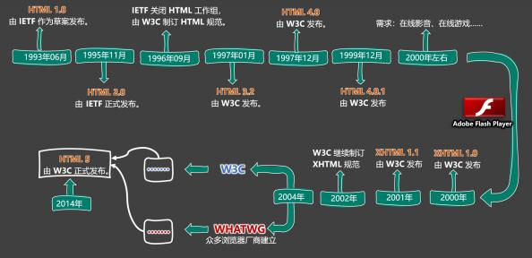

> **三、** **准备工作**
>
> **1.** **常用电脑设置**

<table>
<colgroup>
<col style="width: 67%" />
<col style="width: 32%" />
</colgroup>
<tbody>
<tr>
<td colspan="2"><blockquote>
<p>1. 查看文件夹内容的几种布局。</p>
<p>2. 展示文件扩展名（文件后缀）。</p>
<p>3. 使用指定程序打开文件。</p>
<p>4. 配置文件的默认打开方式。</p>
</blockquote></td>
</tr>
<tr>
<td><blockquote>
<p><strong>2.</strong> <strong>安装Chrome浏览器</strong></p>
</blockquote></td>
<td></td>
</tr>
<tr>
<td colspan="2"><blockquote>
<p>1. 下载地址： <a
href="https://www.google.cn/chrome"><strong>https://www.google.cn/chrome</strong></a>。</p>
<p>2. 若上述地址打不开，或无法安装，请使用资料中的离线安装包。</p>
<p>3. 详细步骤请参考视频。</p>
</blockquote></td>
</tr>
<tr>
<td><blockquote>
<p><strong>四、</strong> <strong>HTML</strong> <strong>入门</strong></p>
<p><strong>1.</strong> <strong>HTML</strong> <strong>初体验</strong></p>
</blockquote></td>
<td></td>
</tr>
</tbody>
</table>

> 1\. 第一步：鼠标右键 =&gt; 新建 =&gt; 文本文档 =&gt;
> 输入以下内容，并保存。

<table>
<colgroup>
<col style="width: 100%" />
</colgroup>
<tbody>
<tr>
<td><blockquote>
<p>&lt;marquee&gt;尚硅谷，让天下没有难学的技术！&lt; /marquee&gt;</p>
</blockquote></td>
</tr>
</tbody>
</table>

> 2\. 第二步：修改后缀为 .html ，然后双击打开即可。
>
> 3\. 程序员写的叫 **源代码** ，要交给浏览器进行渲染。
>
> 4\. 借助浏览器看网页的 **源代码**，具体操作：
>
> **2.**
> **HTML** **标签**
>
> 1\. **标签** 又称 **元素**，是HTML的基本组成单位。
>
> 2\. 标签分为： **双标签** 与 **单标签** （绝大多数都是双标签）。
>
> 3\. 标签名不区分大小写，但推荐小写，因为小写更规范。 4. 双标签：


> 示例代码：

<table>
<colgroup>
<col style="width: 100%" />
</colgroup>
<tbody>
<tr>
<td><blockquote>
<p>&lt;marquee&gt;尚硅谷，让天下没有难学的技术！&lt; /marquee&gt;</p>
</blockquote></td>
</tr>
</tbody>
</table>

> 5\. 单标签：
>
> 6\. 标签之间的关系：并列关系、嵌套关系，可以使用 tab 键进行缩进：

<table>
<colgroup>
<col style="width: 100%" />
</colgroup>
<tbody>
<tr>
<td><blockquote>
<p>&lt;marquee&gt;</p>
<p>尚硅谷，让天下没有难学的技术！</p>
<p>&lt;input&gt; &lt; /marquee&gt; &lt;input&gt;</p>
</blockquote></td>
</tr>
</tbody>
</table>

> **3.** **HTML** **标签属性**


> 1\. 用于给标签提供 **附加信息**。
>
> 2\. 可以写在： **起始标签** 或 **单标签中**，形式如下：
>
> 3\. 有些特殊的属性，没有属性名，只有属性值，例如：

<table>
<colgroup>
<col style="width: 100%" />
</colgroup>
<tbody>
<tr>
<td><blockquote>
<p>&lt;input disabled&gt;</p>
</blockquote></td>
</tr>
</tbody>
</table>

> 4. 注意点：
>
> 1\.
> 不同的标签，有不同的属性；也有一些通用属性（在任何标签内都能写，后面会详细
> 总结）。
>
> 2\. 属性名、属性值不能乱写，都是W3C规定好的。
>
> 3\. 属性名、属性值，都不区分大小写，但推荐小写。
>
> 4\. 双引号，也可以写成单引号，甚至不写都行，但还是推荐写双引号。
>
> 5\. 标签中不要出现同名属性，否则后写的会失效，例如：

<table>
<colgroup>
<col style="width: 100%" />
</colgroup>
<tbody>
<tr>
<td><blockquote>
<p>&lt;input type= "text " type= "password "&gt;</p>
</blockquote></td>
</tr>
</tbody>
</table>

> **4.**
> **HTML** **基本结构**
>
> 1\. 在网页中，如何查看某段结构的具体代码？ ——
> 点击鼠标右键，选择“检查”。
>
> 2\. 【检查】 和 【查看网页源代码】的区别：


> 【查看网页源代码】看到的是：程序员编写的源代码。
>
> 【检查】看到的是：经过浏览器 “处理” 后的源代码。
> 备注：日常开发中，【检查】用的最多。
>
> 3\. 网页的 **基本结构** 如下：


> 1\. 想要呈现在网页中的内容写在 body 标签中。
>
> 2\. head 标签中的内容不会出现在网页中。
>
> 3\. head 标签中的 title 标签可以指定网页的标题。
>
> 4. 图示：

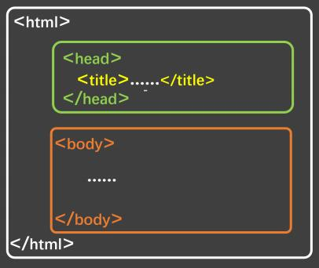

> 5\. 代码：

<table>
<colgroup>
<col style="width: 100%" />
</colgroup>
<tbody>
<tr>
<td><blockquote>
<p>&lt;html&gt;</p>
<p>&lt;head&gt;</p>
<p>&lt;title&gt;网页标题&lt;/title&gt; &lt; /head&gt;</p>
<p>&lt;body&gt;</p>
<p>. . . . . .</p>
<p>&lt; /body&gt; &lt; /html&gt;</p>
</blockquote></td>
</tr>
</tbody>
</table>

> **5.**
> **安装** **VSCode**
>
> 1\. 安装中文语言包。
>
> 2\. 使用 VSCode打开文件夹的两种方式。
>
> 3\. 调整字体大小。
>
> 4\. 设置主题。
>
> 5\. 安装图标主题： vscode-icons 。
>
> 备注：详细安装步骤请参考视频。
>
> **6.** **安装**
> **Live** **Server插件**
>
> 1\. 可以更加方便的打开网页。
>
> 2\. 打开网页的方式更贴近项目上线。
>
> 3\. 代码出现改动后，可以自动刷新。
>
> 4.
> 根据自己的情况，去配置一下 VSCode 的自动保存。
>
> 注意1：务必使用VSCode打开的是文件夹，否则 Live
> Server插件无法正常工作！
>
> **7.** **HTML**
> **注释**
>
> 1\.
> 特点：注释的内容会被浏览器所忽略，不会呈现到页面中，但源代码中依然可见。
>
> 2\. 作用：对代码进行解释和说明。
>
> 3\. 写法：

<table>
<colgroup>
<col style="width: 100%" />
</colgroup>
<tbody>
<tr>
<td><blockquote>
<p>&lt; !-- 下面的文字只能滚动一次 --&gt;</p>
<p>&lt;marquee loop= "1 "&gt;尚硅谷&lt;/marquee&gt;</p>
<p>&lt; !-- 下面的文字可以无限滚动 --&gt;</p>
<p>&lt;marquee&gt;尚硅谷123&lt; /marquee&gt;</p>
</blockquote></td>
</tr>
</tbody>
</table>

> 4\. 注释不可以嵌套，以下这么写是错的（反例）。

<table>
<colgroup>
<col style="width: 100%" />
</colgroup>
<tbody>
<tr>
<td><blockquote>
<p>&lt; !--</p>
<p>我是一段注释</p>
<p>&lt; !-- 我是一段注释 --&gt;</p>
<p>--&gt;</p>
</blockquote></td>
</tr>
</tbody>
</table>

> **8.** **HTML**
> **文档声明**
>
> 1\. 作用：告诉浏览器当前网页的版本。
>
> 2\. 写法：
>
> 。 **旧写法**：要依网页所用的HTML版本而定，写法有很多。
>
> 具体有哪些写法请参考
> ：[**W3C官网-文档声明**](https://www.w3.org/QA/2002/04/valid-dtd-list.html)
> （了解即可，千万别背！）
>
> 。 **新写法：** 一切都变得简单了！ W3C 推荐使用 HTML 5 的写法。

<table>
<colgroup>
<col style="width: 14%" />
<col style="width: 85%" />
</colgroup>
<tbody>
<tr>
<td><blockquote>
<p>&lt; !DOCTYPE</p>
<p>或</p>
<p>&lt; !DOCTYPE</p>
<p>或</p>
<p>&lt; !doctype</p>
</blockquote></td>
<td><blockquote>
<p>html&gt; HTML&gt;</p>
<p>html&gt;</p>
</blockquote></td>
</tr>
</tbody>
</table>

> 3\. 注意：文档声明，必须在网页的第一行，且在 html 标签的外侧。
>
> **9.** **HTML**
> **字符编码**
>
> 1\. 计算机对数据的操作：
>
> 。 存储时，对数据进行： **编码**。
>
> 。 读取时，对数据进行： **解码**。
>
> 2\. 编码、解码，会遵循一定的规范 —— **字符集**。
>
> 3\. 字符集有很多中，常见的有（了解）：


> 1\. ASCII ：大写字母、小写字母、数字、 一些符号，共计128个。
>
> 2\. ISO 8859-1 ：在 ASCII 基础上，扩充了一些希腊字符等，共计是256个。
>
> 3\. GB2312 ：继续扩充，收录了 6763 个常用汉字、 682个字符。
>
> 4\. GBK ：收录了的汉字和符号达到 20000+ ，支持繁体中文。
>
> 5\. UTF-8 ：包含世界上所有语言的：所有文字与符号。 —— 很常用。
>
> 4.
> 使用原则是怎样的？
>
> 原则1：存储时，务必采用合适的字符编码 。
>
> 否则：无法存储，数据会丢失！


> 原则2：存储时采用哪种方式编码 ，读取时就采用哪种方式解码。
>
> 否则：数据错乱（乱码）！

<table>
<colgroup>
<col style="width: 3%" />
<col style="width: 96%" />
</colgroup>
<tbody>
<tr>
<td colspan="2"><blockquote>
<p>例如下面文字中，包含有：中文、英文、泰文、缅甸文</p>
</blockquote></td>
</tr>
<tr>
<td></td>
<td><blockquote>
<p>我爱你</p>
<p>I love you !</p>
<p>ั ั</p>
<p>ฉนรกเธอนะ</p>
<p>   </p>
<p>d⃞ Ⅱ</p>
</blockquote></td>
</tr>
<tr>
<td colspan="2"><blockquote>
<p>若使用 ISO8859-1 编码存储，在存入的那一刻，就出问题了，因为 ISO8859-1
仅支持英 文！</p>
<p>为保证所有的输入，都能正常存储和读取，现在几乎全都采用： UFT-8
编码。</p>
<p>所以我们编写 html 文件时，也都统一用 UFT-8 编码。</p>
</blockquote></td>
</tr>
</tbody>
</table>

> 5\. 总结：
>
> 。 平时编写代码时，统一采用 UTF-8 编码（最稳妥）。
>
> 。 为了让浏览器在渲染 html 文件时，不犯错误，可以通过 meta 标签配合
> charset 属性指 定字符编码。

<table>
<colgroup>
<col style="width: 100%" />
</colgroup>
<tbody>
<tr>
<td><blockquote>
<p>&lt;head&gt;</p>
<p>&lt;meta charset= "UTF-8 " /&gt; &lt; /head&gt;</p>
</blockquote></td>
</tr>
</tbody>
</table>

> **10.**
> **HTML** **设置语言**
>
> 1\. 主要作用：
>
> 
> 让浏览器显示对应的翻译提示。
> 
> 有利于搜索引擎优化。
>
> 2\. 具体写法：

<table>
<colgroup>
<col style="width: 100%" />
</colgroup>
<tbody>
<tr>
<td><blockquote>
<p>&lt;html lang= "zh-CN "&gt;</p>
</blockquote></td>
</tr>
</tbody>
</table>

> 3\. 扩展知识： lang 属性的编写规则（作为一个课外扩展知识，了解即可）。


> 1.
> 第一种写法（语言-国家/地区 ），例如：
>
>  zh-CN ：中文-中国大陆（简体中文）
>
>  zh-TW ：中文-中国台湾（繁体中文）
>
>  zh ：中文
>
>  en-US ：英语-美国
>
>  en-GB ：英语-英国
>
> 2\. 第二种写法（语言—具体种类）已不推荐使用，例如：
>
>  zh-Hans ：中文—简体
>
>  zh-Hant ：中文—繁体
>
> 3\. W3School
> 上的说明：[**《语言代码参考手册》**](https://www.w3school.com.cn/tags/html_ref_language_codes.asp)
> 、[**《国家/地区代码参考手册》**](https://www.w3school.com.cn/tags/html_ref_country_codes.asp)
>
> 4\. W3C官网上的说明： [**《Language** **tags** **in**
> **HTML》**](https://www.w3.org/International/articles/language-tags/)
>
> **11.** **HTML标准结构**


>  HTML标准结构如下：

<table>
<colgroup>
<col style="width: 100%" />
</colgroup>
<tbody>
<tr>
<td><blockquote>
<p>&lt; !DOCTYPE html&gt;</p>
<p>&lt;html lang= "zh-CN "&gt; &lt;head&gt;</p>
<p>&lt;meta charset= "UTF-8 "&gt;</p>
<p>&lt;title&gt;我是一个标题&lt;/title&gt; &lt; /head&gt;</p>
<p>&lt;body&gt;</p>
<p>&lt; /body&gt; &lt; /html&gt;</p>
</blockquote></td>
</tr>
</tbody>
</table>

> · 输入 ! ，随后回车即可快速生成标准结构。
>
> 生成的结构中，有两个meta标签，我们暂时用不到，可以先删掉。
>
> . 配置 VScode 的内置插件 emmet ，可以对生成结构的属性进行定制。
>
> · 在存放代码的文件夹中，存放一个 favicon .ico 图片，可配置网站图标。
>
> **五、** **HTML** **基础**
>
> **1.** **开发者文档**


> · W3C官网： [www.w3c.org](https://www.w3c.org)
>
> · W3School： www .w3school .com .cn
>
> · MDN： developer .mozilla .org —— 平时用的最多。
>
> **2.**
> **排版标签**

<table>
<colgroup>
<col style="width: 13%" />
<col style="width: 67%" />
<col style="width: 19%" />
</colgroup>
<tbody>
<tr>
<td><blockquote>
<p><strong>标签名</strong></p>
</blockquote></td>
<td><blockquote>
<p><strong>标签含义</strong></p>
</blockquote></td>
<td><blockquote>
<p><strong>单</strong> <strong>/</strong> <strong>双</strong>
<strong>标签</strong></p>
</blockquote></td>
</tr>
<tr>
<td><blockquote>
<p>h1 ~ h6</p>
</blockquote></td>
<td><blockquote>
<p>标题</p>
</blockquote></td>
<td><blockquote>
<p>双</p>
</blockquote></td>
</tr>
<tr>
<td><blockquote>
<p>p</p>
</blockquote></td>
<td><blockquote>
<p>段落</p>
</blockquote></td>
<td><blockquote>
<p>双</p>
</blockquote></td>
</tr>
<tr>
<td><blockquote>
<p>div</p>
</blockquote></td>
<td><blockquote>
<p>没有任何含义，用于整体布局（生活中的包装袋）。</p>
</blockquote></td>
<td><blockquote>
<p>双</p>
</blockquote></td>
</tr>
</tbody>
</table>

> 1\. h1 最好写一个， h2~h6 能适当多写。
>
> 2\. h1~h6 不能互相嵌套，例如： h1 标签中最好不要写 h2 标签了。
>
> 3\. p 标签很特殊！它里面不能有： h1~h6 、 p 、 div
> 标签（暂时先这样记，后面会说规律）。
>
> **3.** **语义化标签**

<table>
<colgroup>
<col style="width: 6%" />
<col style="width: 62%" />
<col style="width: 30%" />
</colgroup>
<tbody>
<tr>
<td colspan="3"><blockquote>
<p>
概念：用特定的标签，去表达特定的含义。</p>
<p>· 原则：标签的默认效果不重要（后期可以通过 CSS
随便控制效果），语义最重要！</p>
<p>. 举例：对于 h1
标签，效果是文字很大（不重要），语义是网页主要内容（很重要）。</p>
<p> 优势：</p>
<p>。 代码结构清晰可读性强。</p>
<p>。 有利于 <strong>SEO</strong> （搜索引擎优化）。</p>
<p>。 方便设备解析（如屏幕阅读器、盲人阅读器等）。</p>
</blockquote></td>
</tr>
<tr>
<td colspan="2"><blockquote>
<p><strong>4.</strong> <strong>块级元素</strong> <strong>与</strong>
<strong>行内元素</strong></p>
</blockquote></td>
<td></td>
</tr>
<tr>
<td colspan="3"><blockquote>
<p>1. <strong>块级元素</strong>：独占一行（排版标签都是块级元素）。</p>
</blockquote></td>
</tr>
<tr>
<td colspan="3"><blockquote>
<p>2. <strong>行内元素</strong>：不独占一行（目前只学了： input
，稍后会学习更多）。</p>
</blockquote></td>
</tr>
<tr>
<td colspan="3"><blockquote>
<p>3. <strong>使用原则</strong>：</p>
</blockquote></td>
</tr>
<tr>
<td></td>
<td colspan="2"><blockquote>
<p>1. <strong>块级元素</strong> 中能写 <strong>行内元素</strong> 和
<strong>块级元素</strong> （简单记：块级元素中几乎什么都能写）。</p>
<p>2. <strong>行内元素</strong> 中能写
<strong>行内元素</strong>，但不能写 <strong>块级元素</strong>。</p>
<p>3. 一些特殊的规则：</p>
<p> h1~h6 不能互相嵌套。</p>
<p> p 中不要写块级元素。</p>
</blockquote></td>
</tr>
<tr>
<td colspan="2"><blockquote>
<p><strong>5.文本标签_常用的</strong></p>
</blockquote></td>
<td></td>
</tr>
</tbody>
</table>

> 1\. 用于包裹：词汇、短语等。
>
> 2\. 通常写在排版标签里面。
>
> 3\. 排版标签更宏观（大段的文字），文本标签更微观（词汇、短语）。
>
> 4\. 文本标签通常都是行内元素。

<table style="width:100%;">
<colgroup>
<col style="width: 16%" />
<col style="width: 59%" />
<col style="width: 23%" />
</colgroup>
<tbody>
<tr>
<td><blockquote>
<p><strong>标签名</strong></p>
</blockquote></td>
<td><blockquote>
<p><strong>标签语义</strong></p>
</blockquote></td>
<td><blockquote>
<p><strong>单</strong> <strong>/</strong> <strong>双</strong>
<strong>标签</strong></p>
</blockquote></td>
</tr>
<tr>
<td><blockquote>
<p>em</p>
</blockquote></td>
<td><blockquote>
<p>要着重阅读的内容</p>
</blockquote></td>
<td><blockquote>
<p>双</p>
</blockquote></td>
</tr>
<tr>
<td><blockquote>
<p>strong</p>
</blockquote></td>
<td><blockquote>
<p>十分重要的内容（语气比em要强）</p>
</blockquote></td>
<td><blockquote>
<p>双</p>
</blockquote></td>
</tr>
<tr>
<td><blockquote>
<p>span</p>
</blockquote></td>
<td><blockquote>
<p>没有语义，用于包裹短语的通用容器</p>
</blockquote></td>
<td><blockquote>
<p>双</p>
</blockquote></td>
</tr>
</tbody>
</table>

> **6.文本标签\_不常用的**

<table>
<colgroup>
<col style="width: 18%" />
<col style="width: 67%" />
<col style="width: 13%" />
</colgroup>
<tbody>
<tr>
<td><blockquote>
<p><strong>标签名</strong></p>
</blockquote></td>
<td><blockquote>
<p><strong>标签语义</strong></p>
</blockquote></td>
<td><blockquote>
<p><strong>单/双标</strong></p>
<p><strong>签</strong></p>
</blockquote></td>
</tr>
<tr>
<td><blockquote>
<p>cite</p>
</blockquote></td>
<td><blockquote>
<p>作品标题（书籍、歌曲、电影、电视节目、绘画、雕塑）</p>
</blockquote></td>
<td><blockquote>
<p>双</p>
</blockquote></td>
</tr>
<tr>
<td></td>
<td><blockquote>
<p>特殊术语 ，或专属名词</p>
</blockquote></td>
<td><blockquote>
<p>双</p>
</blockquote></td>
</tr>
<tr>
<td><blockquote>
<p>del 与 ins</p>
</blockquote></td>
<td><blockquote>
<p>删除的文本 【与】 插入的文本</p>
</blockquote></td>
<td><blockquote>
<p>双</p>
</blockquote></td>
</tr>
<tr>
<td><blockquote>
<p>sub 与 sup</p>
</blockquote></td>
<td><blockquote>
<p>下标文字 【与】 上标文字</p>
</blockquote></td>
<td><blockquote>
<p>双</p>
</blockquote></td>
</tr>
<tr>
<td><blockquote>
<p>code</p>
</blockquote></td>
<td><blockquote>
<p>一段代码</p>
</blockquote></td>
<td><blockquote>
<p>双</p>
</blockquote></td>
</tr>
<tr>
<td><blockquote>
<p>samp</p>
</blockquote></td>
<td><blockquote>
<p>从正常的上下文中，将某些内容提取出来，例如：标识设备输出</p>
</blockquote></td>
<td><blockquote>
<p>双</p>
</blockquote></td>
</tr>
<tr>
<td></td>
<td><blockquote>
<p>键盘文本，表示文本是通过键盘输入的，经常用在与计算机相关 的手册中</p>
</blockquote></td>
<td><blockquote>
<p>双</p>
</blockquote></td>
</tr>
<tr>
<td><blockquote>
<p>abbr</p>
</blockquote></td>
<td><blockquote>
<p>缩写，最好配合上 title 属性</p>
</blockquote></td>
<td><blockquote>
<p>双</p>
</blockquote></td>
</tr>
<tr>
<td></td>
<td><blockquote>
<p>更改文本方向，要配合 dir 属性，可选值: ltr （默认值）、 rtl</p>
</blockquote></td>
<td><blockquote>
<p>双</p>
</blockquote></td>
</tr>
<tr>
<td></td>
<td><blockquote>
<p>标记变量，可以与 code 标签一起使用</p>
</blockquote></td>
<td><blockquote>
<p>双</p>
</blockquote></td>
</tr>
<tr>
<td><blockquote>
<p>small</p>
</blockquote></td>
<td><blockquote>
<p>附属细则，例如：包括版权、法律文本。 —— 很少使用</p>
</blockquote></td>
<td><blockquote>
<p>双</p>
</blockquote></td>
</tr>
<tr>
<td><blockquote>
<p>b</p>
</blockquote></td>
<td><blockquote>
<p>摘要中的关键字、评论中的产品名称。 —— 很少使用</p>
</blockquote></td>
<td><blockquote>
<p>双</p>
</blockquote></td>
</tr>
<tr>
<td></td>
<td><blockquote>
<p>本意是：人物的思想活动、所说的话等等。</p>
<p>现在多用于：呈现字体图标（后面要讲的内容）。</p>
</blockquote></td>
<td><blockquote>
<p>双</p>
</blockquote></td>
</tr>
<tr>
<td></td>
<td><blockquote>
<p>与正常内容有反差文本，例如：错的单词、不合适的描述等。 ——
很少使用</p>
</blockquote></td>
<td><blockquote>
<p>双</p>
</blockquote></td>
</tr>
<tr>
<td><blockquote>
<p>q</p>
</blockquote></td>
<td><blockquote>
<p>短引用 —— 很少使用</p>
</blockquote></td>
<td><blockquote>
<p>双</p>
</blockquote></td>
</tr>
<tr>
<td><blockquote>
<p>blockquote</p>
</blockquote></td>
<td><blockquote>
<p>长引用 —— 很少使用</p>
</blockquote></td>
<td><blockquote>
<p>双</p>
</blockquote></td>
</tr>
<tr>
<td><blockquote>
<p>address</p>
</blockquote></td>
<td><blockquote>
<p>地址信息</p>
</blockquote></td>
<td><blockquote>
<p>双</p>
</blockquote></td>
</tr>
</tbody>
</table>


> 备注：
>
> 1\.
> 这些不常用的文本标签，编码时不用过于纠结（酌情而定，不用也没毛病）。
>
> 2\. blockquote 与 address 是块级元素，其他的文本标签，都是行内元素。
>
> 3\. 有些语义感不强的标签，我们很少使用，例如：
>
> small 、 b 、 u 、 q 、 blockquote
>
> 4\.
> HTML标签太多了！记住那些：重要的、语义感强的标签即可；截止目前，有这些：
> h1~h6 、 p 、 div 、 em 、 strong 、 span
>
> **7.** **图片标签**


> **1.** **基本使用**

<table style="width:100%;">
<colgroup>
<col style="width: 10%" />
<col style="width: 12%" />
<col style="width: 60%" />
<col style="width: 15%" />
</colgroup>
<tbody>
<tr>
<td><blockquote>
<p><strong>标签</strong> <strong>名</strong></p>
</blockquote></td>
<td><blockquote>
<p><strong>标签语</strong></p>
<p><strong>义</strong></p>
</blockquote></td>
<td><blockquote>
<p><strong>常用属性</strong></p>
</blockquote></td>
<td><blockquote>
<p><strong>单/双标</strong></p>
<p><strong>签</strong></p>
</blockquote></td>
</tr>
<tr>
<td><blockquote>
<p>img</p>
</blockquote></td>
<td><blockquote>
<p>图片</p>
</blockquote></td>
<td><blockquote>
<p>src ：图片路径（又称：图片地址） —— 图片的具体位置</p>
<p>alt ：图片描述</p>
<p>width ：图片宽度，单位是像素，例如： 200px 或 200</p>
<p>height ：图片高度， 单位是像素，例如： 200px 或 200</p>
</blockquote></td>
<td><blockquote>
<p>单</p>
</blockquote></td>
</tr>
</tbody>
</table>

> 总结：
>
> 1\. 像素（ px ）是一种单位，学到 CSS 时，我们会详细讲解。
>
> 2\. 尽量不同时修改图片的宽和高，可能会造成比例失调。
>
> 3\. 暂且认为 img 是行内元素（学到 CSS
> 时，会认识一个新的元素分类，目前咱们只知道： 块、行内）。
>
> 4\. alt 属性的作用：
>
> 。 搜索引擎通过 alt 属性，得知图片的内容。 —— 最主要的作用。
>
> 。 当图片无法展示时候，有些浏览器会呈现 alt 属性的值。
>
> 。 盲人阅读器会朗读 alt 属性的值。
>
> **2.** **路径的分类**
>
> 1\. **相对路径**：以**当前位置**作为参考点，去建立路径。

<table>
<colgroup>
<col style="width: 18%" />
<col style="width: 10%" />
<col style="width: 11%" />
<col style="width: 59%" />
</colgroup>
<tbody>
<tr>
<td><blockquote>
<p><strong>已有结构</strong></p>
</blockquote></td>
<td><blockquote>
<p><strong>符号</strong></p>
</blockquote></td>
<td><blockquote>
<p><strong>含义</strong></p>
</blockquote></td>
<td><blockquote>
<p><strong>举例（在</strong> 测试 . html <strong>中）</strong></p>
</blockquote></td>
</tr>
<tr>
<td rowspan="3">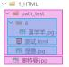</td>
<td><blockquote>
<p>. /</p>
</blockquote></td>
<td><blockquote>
<p>同级</p>
</blockquote></td>
<td><blockquote>
<p>引入【怪兽.jpg】： &lt;img src= " . /怪兽 .jpg "&gt;</p>
</blockquote></td>
</tr>
<tr>
<td></td>
<td><blockquote>
<p>下一 级</p>
</blockquote></td>
<td><blockquote>
<p>引入【喜羊羊.jpg】： &lt;img src= " . /a/喜羊 羊 .jpg "&gt;</p>
</blockquote></td>
</tr>
<tr>
<td></td>
<td><blockquote>
<p>上一 级</p>
</blockquote></td>
<td><blockquote>
<p>引入【奥特曼.jpg】： &lt;img src= " . . /奥特曼 .jpg "&gt;</p>
</blockquote></td>
</tr>
</tbody>
</table>


> 注意点：
>
> 。 相对路径中的 . / 可以省略不写。
>
> 。
> 相对路径依赖的是当前位置，后期若调整了文件位置，那么文件中的路径也要修改。
>
> 2\. **绝对路径**：以**根位置**作为参考点，去建立路径。
>
> 1\. 本地绝对路径： E:/a/b /c/奥特曼 .jpg 。（很少使用）
>
> 2\. 网络绝对路径： <http://www.atguigu.com/images/index_new/logo.png>
> 。


> 注意点：
>
> 。 使用本地绝对路径，
> 一旦更换设备，路径处理起来比较麻烦，所以很少使用。
>
> 。
> 使用网络绝对路径，确实方便，但要注意：若服务器开启了防盗链，会造成图片引入
> 失败。

**3.** **常见图片格式**

> 1\. jpg 格式：


> 概述：扩展名为 .jpg 或 .jpeg
> ，是一种有损的压缩格式（把肉眼不容易观察出来的细节 丢弃了）。
>
> 主要特点： **支持的颜色丰富、占用空间较小**
> 、不支持透明背景、不支持动态图。
>
> 使用场景：对图片细节**没有极高要求**的场景，例如：网站的产品宣传图等
> 。 —— 该格式网 页中很常见。
>
> 2\. png 格式：


> 概述：扩展名为 .png ，是一种无损的压缩格式，能够更高质量的保存图片。
>
> 主要特点： **支持的颜色丰富**、占用空间略大、 **支持透明背景**
> 、不支持动态图。
>
> 使用场景：①想让图片有透明背景；②想更高质量的呈现图片；例如
> ：公司logo图、重要配 图等。
>
> 3\. bmp 格式：


> 概述：扩展名为 .bmp
> ，不进行压缩的一种格式，在最大程度上保留图片更多的细节。
>
> 主要特点：
> **支持的颜色丰富、保留的细节更多**、占用空间极大、不支持透明背景、不支持动
> 态图。
>
> 使用场景：对图片细节**要求极高**的场景，例如： 一些大型游戏中的图片
> 。（网页中很少使 用）
>
> 4\. gif 格式：


> 概述：扩展名为 .gif ，仅支持256种颜色，色彩呈现不是很完整。
>
> 主要特点：支持的颜色较少、 **支持简单透明背景、支持动态图**。
>
> 使用场景：网页中的动态图片。
>
> 5\. web p 格式：


> 概述：扩展名为 .web p ，谷歌推出的一种格式，专门用来在网页中呈现图片。
>
> 主要特点：具备上述几种格式的优点，但兼容性不太好，
> 一旦使用务必要解决兼容性问题。
>
> 使用场景：网页中的各种图片。
>
> 6. base64
> 格式
>
> 1\. 本质：一串特殊的文本，要通过浏览器打开，传统看图应用通常无法打开。
>
> 2\. 原理：把图片进行 base64 编码，形成一串文本。
>
> 3\. 如何生成：靠一些工具或网站。
>
> 4\. 如何使用：直接作为 img 标签的 src
> 属性的值即可，并且不受文件位置的影响。
>
> 5\. 使用场景： 一些较小的图片，或者需要和网页一起加载的图片。
>
> **图片的格式非常多，上面这些，只是一些常见的、我们前端人员常接触到的。**
>
> **8.** **超链接**


> 主要作用：从当前页面进行跳转。

可以实现：①跳转到指定页面、②跳转到指定文件（也可触发下载）、③跳转到锚点位置、④唤起指定
应用。

<table>
<colgroup>
<col style="width: 11%" />
<col style="width: 13%" />
<col style="width: 59%" />
<col style="width: 15%" />
</colgroup>
<tbody>
<tr>
<td><blockquote>
<p><strong>标签名</strong></p>
</blockquote></td>
<td><blockquote>
<p><strong>标签语义</strong></p>
</blockquote></td>
<td><blockquote>
<p><strong>常用属性</strong></p>
</blockquote></td>
<td><blockquote>
<p><strong>单</strong> <strong>/</strong> <strong>双</strong>
<strong>标签</strong></p>
</blockquote></td>
</tr>
<tr>
<td><blockquote>
<p>a</p>
</blockquote></td>
<td><blockquote>
<p>超链接</p>
</blockquote></td>
<td><blockquote>
<p>href ： 指定要跳转到的具体目标。</p>
<p>target ： 控制跳转时如何打开页面，常用值如下:</p>
<p><strong>_self</strong> ：在本窗口打开。</p>
<p><strong>_blank</strong> ：在新窗口打开。</p>
<p>id ： 元素的唯一 标识，可用于设置锚点。</p>
<p>name ： 元素的名字，写在 a 标签中，也能设置锚点。</p>
</blockquote></td>
<td><blockquote>
<p>双</p>
</blockquote></td>
</tr>
</tbody>
</table>

> **1.** **跳转到页面**

<table>
<colgroup>
<col style="width: 100%" />
</colgroup>
<tbody>
<tr>
<td><blockquote>
<p>&lt; !-- 跳转其他网页 --&gt;</p>
<p>&lt;a href="<a href="https://www.jd.com/">https://www.jd.com/</a>"
target="_blank"&gt;去京东&lt;/a&gt;</p>
<p>&lt; !-- 跳转本地网页 --&gt;</p>
<p>&lt;a href= " . /10_HTML排版标签 .html " target=
"_self"&gt;去看排版标签&lt;/a&gt;</p>
</blockquote></td>
</tr>
</tbody>
</table>


> 注意点：
>
> 1\. 代码中的**多个空格** 、 **多个回车**，都会被浏览器解析成一个空格！
>
> 2\. 虽然 a 是行内元素，但 a 元素可以包裹除它自身外的任何元素！
> 想展示多个回车或空格，怎么办呢？ —— 后面会讲。
>
> **2.** **跳转到文件**

<table>
<colgroup>
<col style="width: 100%" />
</colgroup>
<tbody>
<tr>
<td><blockquote>
<p>&lt; !-- 浏览器能直接打开的文件 --&gt;</p>
<p>&lt;a href= " . /resource/自拍 .jpg"&gt;看自拍&lt;/a&gt;</p>
<p>&lt;a href= " . /resource/小电影 .mp4"&gt;看小电影&lt;/a&gt;</p>
<p>&lt;a href= " . /resource/小姐姐 .gif"&gt;看小姐姐&lt;/a&gt;</p>
<p>&lt;a href= " . /resource/如何一夜暴富
.pdf"&gt;点我一夜暴富&lt;/a&gt;</p>
<p>&lt; !-- 浏览器不能打开的文件，会自动触发下载 --&gt;</p>
<p>&lt;a href= " . /resource/内部资源 .zip"&gt;内部资源&lt;/a&gt;</p>
<p>&lt; !-- 强制触发下载 --&gt;</p>
<p>&lt;a href= " . /resource/小电影 .mp4 " download= " 电影片段
.mp4"&gt;下载电影&lt;/a&gt;</p>
</blockquote></td>
</tr>
</tbody>
</table>


> 注意1：若浏览器无法打开文件，则会引导用户下载。
>
> 注意2：若想强制触发下载，请使用 download
> 属性，属性值即为下载文件的名称。
>
> **3.** **跳转到锚点**
>
> 什么是锚点？ —— 网页中的一个标记点。 具体使用方式：
>
>  **第一步：设置锚点**

<table>
<colgroup>
<col style="width: 100%" />
</colgroup>
<tbody>
<tr>
<td><blockquote>
<p>&lt; !-- 第一种方式： a标签配合name属性 --&gt; &lt;a name=
"test1"&gt;&lt;/a&gt;</p>
<p>&lt; !-- 第二种方式：其他标签配合id属性 --&gt; &lt;h2 id=
"test2"&gt;我是一个位置&lt;/h2&gt;</p>
</blockquote></td>
</tr>
</tbody>
</table>


> 注意点：
>
> 1\. 具有 href 属性的 a 标签是**超链接**，具有 name 属性的 a
> 标签是**锚点**。
>
> 2\. name 和 id 都是区分大小写的，且 id 最好别是数字开头。
>
>  **第二步：跳转锚点**

<table>
<colgroup>
<col style="width: 100%" />
</colgroup>
<tbody>
<tr>
<td><blockquote>
<p>&lt; !-- 跳转到test1锚点--&gt;</p>
<p>&lt;a href= "#test1"&gt;去test1锚点&lt;/a&gt;</p>
<p>&lt; !-- 跳到本页面顶部 --&gt; &lt;a href= "#
"&gt;回到顶部&lt;/a&gt;</p>
<p>&lt; !-- 跳转到其他页面锚点 --&gt;</p>
<p>&lt;a href= "demo .html#test1"&gt;去demo
.html页面的test1锚点&lt;/a&gt;</p>
<p>&lt; !-- 刷新本页面 --&gt;</p>
<p>&lt;a href= ""&gt;刷新本页面&lt;/a&gt;</p>
<p>&lt; !-- 执行一段js ,如果还不知道执行什么，可以留空，javascript : ;
--&gt; &lt;a href= "javascript:alert(1 ) ; "&gt;点我弹窗&lt;/a&gt;</p>
</blockquote></td>
</tr>
</tbody>
</table>

> **4.** **唤起指定应用**
>
> 通过 a 标签，可以唤起设备应用程序。

<table>
<colgroup>
<col style="width: 100%" />
</colgroup>
<tbody>
<tr>
<td><blockquote>
<p>&lt; !-- 唤起设备拨号 --&gt;</p>
<p>&lt;a href= "tel :10010"&gt;电话联系&lt;/a&gt;</p>
<p>&lt; !-- 唤起设备发送邮件 --&gt;</p>
<p>&lt;a href= "mailto:10010@qq.com "&gt;邮件联系&lt;/a&gt; &lt; !--
唤起设备发送短信 --&gt;</p>
<p>&lt;a href= "sms:10086"&gt;短信联系&lt;/a&gt;</p>
</blockquote></td>
</tr>
</tbody>
</table>

> **9.** **列表**


> **1.** **有序列表**
>
> 概念：有顺序或侧重顺序的列表。

<table>
<colgroup>
<col style="width: 100%" />
</colgroup>
<tbody>
<tr>
<td><blockquote>
<p>&lt;h2&gt;要把大象放冰箱总共分几步&lt;/h2&gt; &lt;ol&gt;</p>
<p>&lt;li&gt;把冰箱门打开&lt;/li&gt;
&lt;li&gt;把大象放进去&lt;/li&gt;</p>
<p>&lt;li&gt;把冰箱门关上&lt;/li&gt; &lt; /ol&gt;</p>
</blockquote></td>
</tr>
</tbody>
</table>

> **2.** **无序列表**
>
> 概念：无顺序或不侧重顺序的列表。

<table>
<colgroup>
<col style="width: 100%" />
</colgroup>
<tbody>
<tr>
<td><blockquote>
<p>&lt;h2&gt;我想去的几个城市&lt;/h2&gt; &lt;ul&gt;</p>
<p>&lt;li&gt;成都&lt;/li&gt;</p>
<p>&lt;li&gt;上海&lt;/li&gt;</p>
<p>&lt;li&gt;西安&lt;/li&gt;</p>
<p>&lt;li&gt;武汉&lt;/li&gt; &lt; /ul&gt;</p>
</blockquote></td>
</tr>
</tbody>
</table>

> **3.** **列表嵌套**
>
> 概念：列表中的某项内容，又包含一个列表（注意：嵌套时，请务必把解构写完整）。
>
> **4.** **自定义列表**
>
> 1\.
> 概念：所谓自定义列表，就是一个包含**术语名称**以及**术语描述**的列表。
>
> 2\. 一个 dl 就是一个自定义列表， 一个 dt 就是一个术语名称， 一个 dd
> 就是术语描述（可以有多 个）。

<table>
<colgroup>
<col style="width: 100%" />
</colgroup>
<tbody>
<tr>
<td><blockquote>
<p>&lt;h2&gt;如何高效的学习？&lt; /h2&gt; &lt;dl&gt;</p>
<p>&lt;dt&gt;做好笔记&lt;/dt&gt;</p>
<p>&lt;dd&gt;笔记是我们以后复习的一个抓手&lt;/dd&gt;</p>
<p>&lt;dd&gt;笔记可以是电子版，也可以是纸质版&lt;/dd&gt;
&lt;dt&gt;多加练习&lt;/dt&gt;</p>
<p>&lt;dd&gt;只有敲出来的代码，才是自己的&lt;/dd&gt;
&lt;dt&gt;别怕出错&lt;/dt&gt;</p>
<p>&lt;dd&gt;错很正常，改正后并记住，就是经验&lt;/dd&gt; &lt;
/dl&gt;</p>
</blockquote></td>
</tr>
</tbody>
</table>

> **10.** **表格**


> **1.** **基本结构**
>
> 1\. 一个完整的表格由： **表格标题** 、 **表格头部** 、 **表格主体** 、
> **表格脚注**，四部分组成。

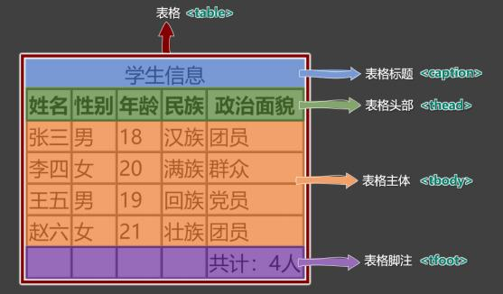

> 2\. 表格涉及到的标签： table ：表格
>
> caption ：表格标题
>
> thead ：表格头部
>
> tbody ：表格主体
>
> tfoot ：表格注脚
>
> tr ：每一行
>
> th 、 td ：每一个单元格（备注：表格头部中用 th
> ，表格主体、表格脚注中用： td ）

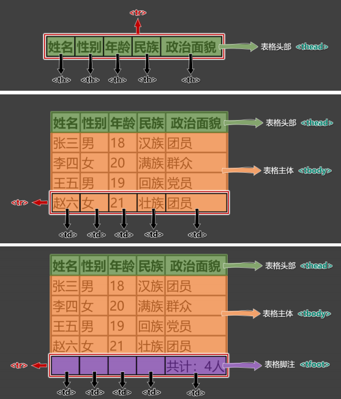

3\. 具体编码：

> &lt;table border= "1 "&gt;
>
> &lt; !-- 表格标题 --&gt;
>
> &lt;caption&gt;学生信息&lt;/caption&gt;
>
> &lt; !-- 表格头部 --&gt;
>
> &lt;thead&gt;
>
> &lt;tr&gt;
>
> &lt;th&gt;姓名&lt;/th&gt;
>
> &lt;th&gt;性别&lt;/th&gt;
>
> &lt;th&gt;年龄&lt;/th&gt;
>
> &lt;th&gt;民族&lt;/th&gt;
>
> &lt;th&gt;政治面貌&lt;/th&gt; &lt; /tr&gt;
>
> &lt; /thead&gt;

**2.** **常用属性**

<table style="width:100%;">
<colgroup>
<col style="width: 12%" />
<col style="width: 13%" />
<col style="width: 60%" />
<col style="width: 13%" />
</colgroup>
<tbody>
<tr>
<td><blockquote>
<p><strong>标签名</strong></p>
</blockquote></td>
<td><blockquote>
<p><strong>标签语义</strong></p>
</blockquote></td>
<td><blockquote>
<p><strong>常用属性</strong></p>
</blockquote></td>
<td><blockquote>
<p><strong>单/双标</strong> <strong>签</strong></p>
</blockquote></td>
</tr>
<tr>
<td></td>
<td><blockquote>
<p>表格</p>
</blockquote></td>
<td><blockquote>
<p>width ：设置表格宽度。</p>
<p>height ：设置表格<strong>最小</strong>高度，表格最终高度可能比设置
的值大。</p>
<p>border ：设置表格边框宽度。</p>
<p>cellspacing ： 设置单元格之间的间距。</p>
</blockquote></td>
<td><blockquote>
<p>双</p>
</blockquote></td>
</tr>
<tr>
<td><blockquote>
<p>thead</p>
</blockquote></td>
<td><blockquote>
<p>表格头部</p>
</blockquote></td>
<td><blockquote>
<p>height ：设置表格头部高度。</p>
<p>align ： 设置单元格的<strong>水平</strong>对齐方式，可选值如下：</p>
<p>1. left ：左对齐</p>
<p>2. center ：中间对齐</p>
<p>3. right ：右对齐</p>
<p>valign ：设置单元格的<strong>垂直</strong>对齐方式，可选值如下：</p>
<p>1. top ：顶部对齐</p>
<p>2. middle ：中间对齐</p>
<p>3. bottom ：底部对齐</p>
</blockquote></td>
<td><blockquote>
<p>双</p>
</blockquote></td>
</tr>
<tr>
<td><blockquote>
<p>tbody</p>
</blockquote></td>
<td><blockquote>
<p>表格主体</p>
</blockquote></td>
<td><blockquote>
<p>常用属性与 thead 相同。</p>
</blockquote></td>
<td><blockquote>
<p>双</p>
</blockquote></td>
</tr>
<tr>
<td><blockquote>
<p>tr</p>
</blockquote></td>
<td><blockquote>
<p>行</p>
</blockquote></td>
<td><blockquote>
<p>常用属性与 thead 相同。</p>
</blockquote></td>
<td><blockquote>
<p>双</p>
</blockquote></td>
</tr>
<tr>
<td><blockquote>
<p>tfoot</p>
</blockquote></td>
<td><blockquote>
<p>表格脚注</p>
</blockquote></td>
<td><blockquote>
<p>常用属性与 thead 相同。</p>
</blockquote></td>
<td><blockquote>
<p>双</p>
</blockquote></td>
</tr>
<tr>
<td><blockquote>
<p>td</p>
</blockquote></td>
<td><blockquote>
<p>普通单元</p>
<p>格</p>
</blockquote></td>
<td><blockquote>
<p>width ：设置单元格的宽度，同列所有单元格全都受影 响。</p>
<p>heigth ：设置单元格的高度，同行所有单元格全都受影 响。</p>
<p>align ：设置单元格的水平对齐方式。</p>
<p>valign ：设置单元格的垂直对齐方式。</p>
<p>rowspan ：指定要跨的行数。</p>
<p>colspan ：指定要跨的列数。</p>
</blockquote></td>
<td><blockquote>
<p>双</p>
</blockquote></td>
</tr>
<tr>
<td></td>
<td><blockquote>
<p>表头单元 格</p>
</blockquote></td>
<td><blockquote>
<p>常用属性与 td 相同。</p>
</blockquote></td>
<td><blockquote>
<p>双</p>
</blockquote></td>
</tr>
</tbody>
</table>

> 注意点：
>
> 1\. &lt;table&gt; 元素的 border 属性可以控制表格边框，但 border
> 值的大小，并不控制单元格 边框的宽度，
>
> 只能控制表格最外侧边框的宽度，这个问题如何解决？ —— 后期靠 CSS 控制。
>
> 2\. 默认情况下，每列的宽度，得看这一列单元格最长的那个文字。
>
> 3\. 给某个 th 或 td 设置了宽度之后，他们所在的那一列的宽度就确定了。
>
> 4\. 给某个 th 或 td 设置了高度之后，他们所在的那一行的高度就确定了。
>
> **3.** **跨行跨列**
>
> 1\. rowspan ：指定要跨的行数。
>
> 2\. colspan ：指定要跨的列数。 课程表效果：

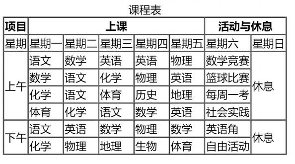

> 编写思路：

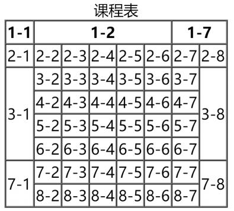

> **11.常用标签补充**

<table>
<colgroup>
<col style="width: 14%" />
<col style="width: 65%" />
<col style="width: 20%" />
</colgroup>
<tbody>
<tr>
<td><blockquote>
<p><strong>标签名</strong></p>
</blockquote></td>
<td><blockquote>
<p><strong>标签含义</strong></p>
</blockquote></td>
<td><blockquote>
<p><strong>单</strong> <strong>/</strong> <strong>双</strong>
<strong>标签</strong></p>
</blockquote></td>
</tr>
<tr>
<td></td>
<td><blockquote>
<p>换行</p>
</blockquote></td>
<td><blockquote>
<p>单</p>
</blockquote></td>
</tr>
<tr>
<td></td>
<td><blockquote>
<p>分隔</p>
</blockquote></td>
<td><blockquote>
<p>单</p>
</blockquote></td>
</tr>
<tr>
<td></td>
<td><blockquote>
<p>按原文显示（一般用于在页面中嵌入大段代码）</p>
</blockquote></td>
<td><blockquote>
<p>双</p>
</blockquote></td>
</tr>
</tbody>
</table>


> 注意点：
>
> 1\. 不要用 &lt;br&gt; 来增加文本之间的行间隔，应使用 &lt;p&gt;
> 元素，或后面即将学到的 CSS margin 属性。
>
> 2\. &lt;hr&gt;
> 的语义是分隔，如果不想要语义，只是想画一条水平线，那么应当使用 CSS
> 完成。
>
> **12.** **表单**


> 概念：一个包含交互的区域，用于收集用户提供的数据。
>
> **1.** **基本结构**
>
> 简单梳理：

<table>
<colgroup>
<col style="width: 13%" />
<col style="width: 9%" />
<col style="width: 66%" />
<col style="width: 11%" />
</colgroup>
<tbody>
<tr>
<td><blockquote>
<p><strong>标签名</strong></p>
</blockquote></td>
<td><blockquote>
<p><strong>标签</strong></p>
<p><strong>语义</strong></p>
</blockquote></td>
<td><blockquote>
<p><strong>常用属性</strong></p>
</blockquote></td>
<td><blockquote>
<p><strong>单/双</strong> <strong>标签</strong></p>
</blockquote></td>
</tr>
<tr>
<td><blockquote>
<p>form</p>
</blockquote></td>
<td><blockquote>
<p>表单</p>
</blockquote></td>
<td><blockquote>
<p>action ：用于指定表单的提交地址（需要与后端人员沟通后确 定）。</p>
<p>target ：用于控制表单提交后，如何打开页面，常用值如下：</p>
<p>_self ：在本窗口打开。</p>
<p>_blank ：在新窗口打开。</p>
<p>method ：用于控制表单的提交方式，暂时只需了解，在后面 Ajax
的课程中，会详细讲解。</p>
</blockquote></td>
<td><blockquote>
<p>双</p>
</blockquote></td>
</tr>
<tr>
<td></td>
<td><blockquote>
<p>输入 框</p>
</blockquote></td>
<td><blockquote>
<p>type ：设置输入框的类型，目前用到的值是 text ，表示普通 文本。</p>
<p>name ：用于指定提交数据的名字，（需要与后端人员沟通后确 定）。</p>
</blockquote></td>
<td><blockquote>
<p>单</p>
</blockquote></td>
</tr>
<tr>
<td><blockquote>
<p>button</p>
</blockquote></td>
<td><blockquote>
<p>按钮</p>
</blockquote></td>
<td><blockquote>
<p>本小节暂不涉及</p>
</blockquote></td>
<td><blockquote>
<p>双</p>
</blockquote></td>
</tr>
</tbody>
</table>

> 在本小节，我们先记住表单的整体形式，稍后会对表单控件进行详细讲解。
>
> 示例代码：

<table>
<colgroup>
<col style="width: 100%" />
</colgroup>
<tbody>
<tr>
<td><blockquote>
<p>&lt;form action="<a
href="https://www.baidu.com/s">https://www.baidu.com/s</a>"
target="_blank" method="get"&gt; &lt;input type= "text " name= "wd
"&gt;</p>
<p>&lt;button&gt;去百度搜索&lt;/button&gt; &lt; /form&gt;</p>
</blockquote></td>
</tr>
</tbody>
</table>

> **2.** **常用表单控件**
>
> **①** **文本输入框**

<table>
<colgroup>
<col style="width: 100%" />
</colgroup>
<tbody>
<tr>
<td><blockquote>
<p>&lt;input type= "text "&gt;</p>
</blockquote></td>
</tr>
</tbody>
</table>


> 常用属性如下：
>
> name 属性：数据的名称。
>
> value 属性：输入框的默认输入值。
>
> maxlength 属性：输入框最大可输入长度。
>
> **②** **密码输入框**

<table>
<colgroup>
<col style="width: 100%" />
</colgroup>
<tbody>
<tr>
<td><blockquote>
<p>&lt;input type= "password "&gt;</p>
</blockquote></td>
</tr>
</tbody>
</table>


> 常用属性如下：
>
> name 属性：数据的名称。
>
> value 属性：输入框的默认输入值（一般不用，无意义）。
>
> maxlength 属性：输入框最大可输入长度。
>
> **③** **单选框**

<table>
<colgroup>
<col style="width: 100%" />
</colgroup>
<tbody>
<tr>
<td><blockquote>
<p>&lt;input type= " radio " name= "sex " value= "female "&gt;女</p>
<p>&lt;input type= " radio " name= "sex " value= "male "&gt;男</p>
</blockquote></td>
</tr>
</tbody>
</table>


> 常用属性如下：
>
> name 属性：数据的名称，注意：想要单选效果，多个 radio 的 name
> 属性值要保持一致。
>
> value 属性：提交的数据值。
>
> checked 属性：让该单选按钮默认选中。
>
> **④** **复选框**

<table>
<colgroup>
<col style="width: 100%" />
</colgroup>
<tbody>
<tr>
<td><blockquote>
<p>&lt;input type= "checkbox " name= "hobby " value= "smoke
"&gt;抽烟</p>
<p>&lt;input type= "checkbox " name= "hobby " value= "drink"&gt;喝酒</p>
<p>&lt;input type= "checkbox " name= "hobby " value= "perm"&gt;烫头</p>
</blockquote></td>
</tr>
</tbody>
</table>


> 常用属性如下：：
>
> name 属性：数据的名称。
>
> value 属性：提交的数据值。
>
> checked 属性：让该复选框默认选中。
>
> **⑤** **隐藏域**

<table>
<colgroup>
<col style="width: 100%" />
</colgroup>
<tbody>
<tr>
<td><blockquote>
<p>&lt;input type= "hidden " name= "tag " value= "100 "&gt;</p>
</blockquote></td>
</tr>
</tbody>
</table>


> 用户不可见的一个输入区域，作用是：
> 提交表单的时候，携带一些固定的数据。 name 属性：指定数据的名称。
>
> value 属性：指定的是真正提交的数据。
>
> **⑥** **提交按钮**

<table>
<colgroup>
<col style="width: 100%" />
</colgroup>
<tbody>
<tr>
<td><blockquote>
<p>&lt;input type= "submit " value= "点我提交表单 "&gt;
&lt;button&gt;点我提交表单&lt;/button&gt;</p>
</blockquote></td>
</tr>
</tbody>
</table>


> 注意：
>
> 1\. button 标签 type 属性的默认值是 submit 。
>
> 2\. button 不要指定 name 属性
>
> 3\. input 标签编写的按钮，使用 value 属性指定按钮文字。
>
> **⑦** **重置按钮**

<table>
<colgroup>
<col style="width: 100%" />
</colgroup>
<tbody>
<tr>
<td><blockquote>
<p>&lt;input type= " reset " value= "点我重置 "&gt; &lt;button type= "
reset"&gt;点我重置&lt;/button&gt;</p>
</blockquote></td>
</tr>
</tbody>
</table>


> 注意点：
>
> 1\. button 不要指定 name 属性
>
> 2\. input 标签编写的按钮，使用 value 属性指定按钮文字。
>
> **⑧** **普通按钮**

<table>
<colgroup>
<col style="width: 100%" />
</colgroup>
<tbody>
<tr>
<td><blockquote>
<p>&lt;input type= "button " value= "普通按钮 "&gt; &lt;button type=
"button"&gt;普通按钮&lt;/button&gt;</p>
</blockquote></td>
</tr>
</tbody>
</table>


注意点：普通按钮的 type 值为 button ，若不写 type 值是 submit
会引起表单的提交。

> **⑨文本域**

<table>
<colgroup>
<col style="width: 100%" />
</colgroup>
<tbody>
<tr>
<td><blockquote>
<p>&lt;textarea name= "msg " rows= "22 " cols= "3
"&gt;我是文本域&lt;/textarea&gt;</p>
</blockquote></td>
</tr>
</tbody>
</table>


> 常用属性如下：
>
> 1\. rows 属性：指定默认显示的行数，会影响文本域的高度。
>
> 2\. cols 属性：指定默认显示的列数，会影响文本域的宽度。
>
> 3\. 不能编写 type 属性，其他属性，与普通文本输入框一致。
>
> **⑩** **下拉框**

<table>
<colgroup>
<col style="width: 100%" />
</colgroup>
<tbody>
<tr>
<td><blockquote>
<p>&lt;select name= "from "&gt;</p>
</blockquote>
<table>
<colgroup>
<col style="width: 25%" />
<col style="width: 74%" />
</colgroup>
<tbody>
<tr>
<td><blockquote>
<p>&lt;option</p>
</blockquote></td>
<td><blockquote>
<p>value= "黑 "&gt;黑龙江&lt;/option&gt;</p>
</blockquote></td>
</tr>
<tr>
<td><blockquote>
<p>&lt;option</p>
</blockquote></td>
<td><blockquote>
<p>value= "辽 "&gt;辽宁&lt;/option&gt;</p>
</blockquote></td>
</tr>
<tr>
<td><blockquote>
<p>&lt;option</p>
</blockquote></td>
<td><blockquote>
<p>value= "吉 "&gt;吉林&lt;/option&gt;</p>
</blockquote></td>
</tr>
<tr>
<td><blockquote>
<p>&lt;option</p>
</blockquote></td>
<td style="text-align: right;">value= "粤 "
selected&gt;广东&lt;/option&gt;</td>
</tr>
<tr>
<td>&lt; /select&gt;</td>
<td></td>
</tr>
</tbody>
</table></td>
</tr>
</tbody>
</table>


> 常用属性及注意事项：
>
> 1\. name 属性：指定数据的名称。
>
> 2\. option 标签设置 value 属性， 如果没有 value 属性，提交的数据是
> option 中间的文 字；如果设置了 value 属性，提交的数据就是 value
> 的值（建议设置 value 属性）
>
> 3\. option 标签设置了 selected 属性，表示默认选中。
>
> **3.** **禁用表单控件**
>
> 给表单控件的标签设置 disabled 既可禁用表单控件。
>
> **4.label** **标签**
>
> label
> 标签可与表单控件相关联，关联之后点击文字，与之对应的表单控件就会获取焦点。
> 两种与 label 关联方式如下：
>
> 1\. 让 label 标签的 for 属性的值等于表单控件的 id 。
>
> 2\. 把表单控件套在 label 标签的里面。
>
> **5.** **fieldset** **与** **legend** **的使用（了解）**

fieldset 可以为表单控件分组、 legend 标签是分组的标题。

> 示例：

<table>
<colgroup>
<col style="width: 100%" />
</colgroup>
<tbody>
<tr>
<td><blockquote>
<p>&lt;fieldset&gt;</p>
<p>&lt;legend&gt;主要信息&lt;/legend&gt;</p>
<p>&lt;label for= "zhanghu "&gt;账户： &lt; /label&gt;</p>
<p>&lt;input id= "zhanghu " type= "text " name= "account " maxlength=
"10"&gt;&lt;br&gt; &lt;label&gt;</p>
<p>密码：</p>
<p>&lt;input id= "mima " type= "password " name= "pwd " maxlength= "6
"&gt; &lt; /label&gt;</p>
<p>&lt;br&gt;</p>
<p>性别：</p>
<p>&lt;input type= " radio " name= "gender " value= "male " id= "nan
"&gt;</p>
<p>&lt;label for= "nan "&gt;男&lt;/label&gt;</p>
<p>&lt;label&gt;</p>
<p>&lt;input type= " radio " name= "gender " value= "female " id= "nv
"&gt;女</p>
<p>&lt; /label&gt; &lt; /fieldset&gt;</p>
</blockquote></td>
</tr>
</tbody>
</table>

> **6.** **表单总结**

<table>
<colgroup>
<col style="width: 15%" />
<col style="width: 6%" />
<col style="width: 77%" />
</colgroup>
<tbody>
<tr>
<td><blockquote>
<p><strong>标签名</strong></p>
</blockquote></td>
<td><blockquote>
<p><strong>标</strong> <strong>签</strong> <strong>语</strong>
<strong>义</strong></p>
</blockquote></td>
<td><blockquote>
<p><strong>常用属性</strong></p>
</blockquote></td>
</tr>
<tr>
<td></td>
<td><blockquote>
<p>表 单</p>
</blockquote></td>
<td><blockquote>
<p>action 属性： 表单要提交的地址。</p>
<p>target 属性： 要跳转的新地址打开位置; 值: _self 、 _blank</p>
<p>method 属性： 请求方式，值： get 、 post</p>
</blockquote></td>
</tr>
<tr>
<td></td>
<td><blockquote>
<p>多 种 形 式 的 表 单 控 件</p>
</blockquote></td>
<td><blockquote>
<p>type 属性： 指定表单控件的类型。</p>
<p>值： text 、 password 、 radio 、 checkbox 、 hidden 、 submit 、 res
button 等。</p>
<p>name 属性： 指定数据名称 value 属性：</p>
<p>对于输入框：指定默认输入的值；</p>
<p>对于单选和复选框：实际提交的数据；</p>
<p>对于按钮：显示按钮文字。</p>
<p>disabled 属性： 设置表单控件不可用。</p>
<p>maxlength 属性： 用于输入框，设置最大可输入长度。</p>
<p>checked 属性： 用于单选按钮和复选框，默认选中</p>
</blockquote></td>
</tr>
<tr>
<td></td>
<td><blockquote>
<p>文 本 域</p>
</blockquote></td>
<td><blockquote>
<p>name 属性： 指定数据名称</p>
<p>rows 属性： 指定默认显示的行数，影响文本域的高度。</p>
<p>cols 属性： 指定默认显示的列数，影响文本域的宽度。</p>
<p>disabled 属性： 设置表单控件不可用。</p>
</blockquote></td>
</tr>
<tr>
<td><blockquote>
<p>select</p>
</blockquote></td>
<td><blockquote>
<p>下 拉 框</p>
</blockquote></td>
<td><blockquote>
<p>name 属性： 指定数据名称</p>
<p>disabled 属性： 设置整个下拉框不可用。</p>
</blockquote></td>
</tr>
<tr>
<td><blockquote>
<p>option</p>
</blockquote></td>
<td><blockquote>
<p>下 拉 框 的 选 项</p>
</blockquote></td>
<td><blockquote>
<p>disabled 属性： 设置拉下选项不可用。</p>
<p>value 属性： 该选项事件提交的数据</p>
<p>（不指定value，会把标签中的内容作为提交数据） selected 属性：
默认选中。</p>
</blockquote></td>
</tr>
<tr>
<td><blockquote>
<p>button</p>
</blockquote></td>
<td><blockquote>
<p>按 钮</p>
</blockquote></td>
<td><blockquote>
<p>disabled 属性： 设置按钮不可用。</p>
<p>type 属性： 设置按钮的类型，值： submit （默认）、 reset 、
button</p>
</blockquote></td>
</tr>
<tr>
<td></td>
<td><blockquote>
<p>与 表 单 控 件 做 关 联</p>
</blockquote></td>
<td><blockquote>
<p>for 属性： 值与要关联的表单控件的ID值相同。</p>
</blockquote></td>
</tr>
<tr>
<td><blockquote>
<p>fieldset</p>
</blockquote></td>
<td><blockquote>
<p>表 单 边 框</p>
</blockquote></td>
<td></td>
</tr>
</tbody>
</table>


> **13.框架标签**

<table>
<colgroup>
<col style="width: 13%" />
<col style="width: 30%" />
<col style="width: 43%" />
<col style="width: 13%" />
</colgroup>
<tbody>
<tr>
<td><blockquote>
<p><strong>标签名</strong></p>
</blockquote></td>
<td><blockquote>
<p><strong>功能和语义</strong></p>
</blockquote></td>
<td><blockquote>
<p><strong>属性</strong></p>
</blockquote></td>
<td><blockquote>
<p><strong>单</strong> <strong>/</strong> <strong>双标</strong></p>
<p><strong>签</strong></p>
</blockquote></td>
</tr>
<tr>
<td><blockquote>
<p>iframe</p>
</blockquote></td>
<td><blockquote>
<p>框架（在网页中嵌入其他 文件）</p>
</blockquote></td>
<td><blockquote>
<p>name ：框架名字，可以与 target 属 性配合。</p>
<p>width ： 框架的宽。</p>
<p>height ： 框架的高度。</p>
<p>frameborder ：是否显示边框，值： 0 或者1。</p>
</blockquote></td>
<td><blockquote>
<p>双</p>
</blockquote></td>
</tr>
</tbody>
</table>


> iframe 标签的实际应用：
>
> 1\. 在网页中嵌入广告。
>
> 2\. 与超链接或表单的 target 配合，展示不同的内容。
>
> **14.HTML实体**


> 在 HTML
> 中我们可以用一种**特殊的形式**的内容，来表示某个**符号**，这种特殊形式的内容，就是
> HTML 实 体。比如小于号 &lt; 用于定义 HTML
> 标签的开始。如果我们希望浏览器正确地显示这些字符，我们必须 在 HTML
> 源码中插入字符实体。
>
> **字符实体**由三部分组成： 一个 & 和 一个实体名称（或者一个 \# 和
> 一个实体编号），最后加上一 个分号 ; 。
>
> 常见字符实体总结：

<table>
<colgroup>
<col style="width: 11%" />
<col style="width: 38%" />
<col style="width: 26%" />
<col style="width: 23%" />
</colgroup>
<tbody>
<tr>
<td></td>
<td><blockquote>
<p><strong>描述</strong></p>
</blockquote></td>
<td><blockquote>
<p><strong>实体名称</strong></p>
</blockquote></td>
<td><blockquote>
<p><strong>实体编号</strong></p>
</blockquote></td>
</tr>
<tr>
<td></td>
<td><blockquote>
<p><strong>空格</strong></p>
</blockquote></td>
<td></td>
<td><blockquote>
<p><strong>&amp;#160;</strong></p>
</blockquote></td>
</tr>
<tr>
<td><blockquote>
<p><strong>&lt;</strong></p>
</blockquote></td>
<td><blockquote>
<p><strong>小于号</strong></p>
</blockquote></td>
<td></td>
<td><blockquote>
<p><strong>&amp;#60;</strong></p>
</blockquote></td>
</tr>
<tr>
<td><blockquote>
<p><strong>&gt;</strong></p>
</blockquote></td>
<td><blockquote>
<p><strong>大于号</strong></p>
</blockquote></td>
<td></td>
<td><blockquote>
<p><strong>&amp;#62;</strong></p>
</blockquote></td>
</tr>
<tr>
<td><blockquote>
<p><strong>&amp;</strong></p>
</blockquote></td>
<td><blockquote>
<p><strong>和号</strong></p>
</blockquote></td>
<td></td>
<td><blockquote>
<p><strong>&amp;#38;</strong></p>
</blockquote></td>
</tr>
<tr>
<td><blockquote>
<p>"</p>
</blockquote></td>
<td><blockquote>
<p>引号</p>
</blockquote></td>
<td><blockquote>
<p>&amp;quot ;</p>
</blockquote></td>
<td><blockquote>
<p>&amp;#34;</p>
</blockquote></td>
</tr>
<tr>
<td><blockquote>
<p>´</p>
</blockquote></td>
<td><blockquote>
<p>反引号</p>
</blockquote></td>
<td><blockquote>
<p>&amp;acute ;</p>
</blockquote></td>
<td><blockquote>
<p>&amp;#180;</p>
</blockquote></td>
</tr>
<tr>
<td><blockquote>
<p>￠</p>
</blockquote></td>
<td><blockquote>
<p>分（ cent）</p>
</blockquote></td>
<td><blockquote>
<p>&amp;cent ;</p>
</blockquote></td>
<td><blockquote>
<p>&amp;#162;</p>
</blockquote></td>
</tr>
<tr>
<td><blockquote>
<p>£</p>
</blockquote></td>
<td><blockquote>
<p>镑（pound）</p>
</blockquote></td>
<td><blockquote>
<p>&amp;pound ;</p>
</blockquote></td>
<td><blockquote>
<p>&amp;#163;</p>
</blockquote></td>
</tr>
<tr>
<td><blockquote>
<p><strong>¥</strong></p>
</blockquote></td>
<td><blockquote>
<p><strong>元（yen）</strong></p>
</blockquote></td>
<td></td>
<td><blockquote>
<p><strong>&amp;#165;</strong></p>
</blockquote></td>
</tr>
<tr>
<td><blockquote>
<p>€</p>
</blockquote></td>
<td><blockquote>
<p>欧元（ euro）</p>
</blockquote></td>
<td><blockquote>
<p>&amp;euro ;</p>
</blockquote></td>
<td><blockquote>
<p>&amp;#8364;</p>
</blockquote></td>
</tr>
<tr>
<td><blockquote>
<p><strong>©</strong></p>
</blockquote></td>
<td><blockquote>
<p><strong>版权（copyright）</strong></p>
</blockquote></td>
<td></td>
<td><blockquote>
<p><strong>&amp;#169;</strong></p>
</blockquote></td>
</tr>
<tr>
<td><blockquote>
<p>®</p>
</blockquote></td>
<td><blockquote>
<p>注册商标</p>
</blockquote></td>
<td><blockquote>
<p>&amp;reg ;</p>
</blockquote></td>
<td><blockquote>
<p>&amp;#174;</p>
</blockquote></td>
</tr>
<tr>
<td><blockquote>
<p>™</p>
</blockquote></td>
<td><blockquote>
<p>商标</p>
</blockquote></td>
<td><blockquote>
<p>&amp;trade ;</p>
</blockquote></td>
<td><blockquote>
<p>&amp;#8482;</p>
</blockquote></td>
</tr>
<tr>
<td><blockquote>
<p><strong>×</strong></p>
</blockquote></td>
<td><blockquote>
<p><strong>乘号</strong></p>
</blockquote></td>
<td></td>
<td><blockquote>
<p><strong>&amp;#215;</strong></p>
</blockquote></td>
</tr>
<tr>
<td><blockquote>
<p><strong>÷</strong></p>
</blockquote></td>
<td><blockquote>
<p><strong>除号</strong></p>
</blockquote></td>
<td></td>
<td><blockquote>
<p><strong>&amp;#247;</strong></p>
</blockquote></td>
</tr>
</tbody>
</table>

> 完整实体列表，请参考： [**HTML** **Standard**
> **(whatwg.org)**](https://html.spec.whatwg.org/multipage/named-characters.html#named-character-references)
>
> **15.HTML全局属性**


> 常用的全局属性：

<table>
<colgroup>
<col style="width: 12%" />
<col style="width: 87%" />
</colgroup>
<tbody>
<tr>
<td><blockquote>
<p><strong>属性名</strong></p>
</blockquote></td>
<td><blockquote>
<p><strong>含义</strong></p>
</blockquote></td>
</tr>
<tr>
<td></td>
<td><blockquote>
<p>给标签指定唯一标识，注意： id 是不能重复的。</p>
<p>作用：可以让 label 标签与表单控件相关联；也可以与 CSS 、 JavaScript
配合使 用，。</p>
</blockquote></td>
</tr>
<tr>
<td><blockquote>
<p>class</p>
</blockquote></td>
<td><blockquote>
<p>给标签指定类名，随后通过 CSS 就可以给标签设置样式。</p>
</blockquote></td>
</tr>
<tr>
<td><blockquote>
<p>style</p>
</blockquote></td>
<td><blockquote>
<p>给标签设置 CSS 样式。</p>
</blockquote></td>
</tr>
<tr>
<td></td>
<td><blockquote>
<p>内容的方向，值: ltr 、 rtl</p>
</blockquote></td>
</tr>
<tr>
<td><blockquote>
<p>title</p>
</blockquote></td>
<td><blockquote>
<p>给标签设置一个文字提示， 一般超链接和图片用得比较多。</p>
</blockquote></td>
</tr>
<tr>
<td><blockquote>
<p>lang</p>
</blockquote></td>
<td><blockquote>
<p>给标签指定语言，具体规范和可选值请参考【10. HTML 设置语言】。</p>
</blockquote></td>
</tr>
</tbody>
</table>

> 完整的全局属性，请参考： [**全局属性** **-**
> **HTML（超文本标记语言）** **|** **MDN**
> **(mozilla.org)**](https://developer.mozilla.org/zh-CN/docs/Web/HTML/Global_attributes)
>
> **16.meta**
> **元信息**
>
> 1\. 配置字符编码

<table>
<colgroup>
<col style="width: 100%" />
</colgroup>
<tbody>
<tr>
<td><blockquote>
<p>&lt;meta charset= "utf-8 "&gt;</p>
</blockquote></td>
</tr>
</tbody>
</table>

> 2\. 针对 IE 浏览器的兼容性配置。

<table>
<colgroup>
<col style="width: 100%" />
</colgroup>
<tbody>
<tr>
<td><blockquote>
<p>&lt;meta <a href="http-equiv=">http-equiv=</a>"X-UA-Compatible"
content="IE=edge"&gt;</p>
</blockquote></td>
</tr>
</tbody>
</table>

> 3\. 针对移动端的配置（移动端课程中会详细讲解）

<table>
<colgroup>
<col style="width: 100%" />
</colgroup>
<tbody>
<tr>
<td><blockquote>
<p>&lt;meta name= "viewport " content= "width=device-width ,
initial-scale=1 .0 "&gt;</p>
</blockquote></td>
</tr>
</tbody>
</table>

> 4\. 配置网页关键字

<table>
<colgroup>
<col style="width: 100%" />
</colgroup>
<tbody>
<tr>
<td><blockquote>
<p>&lt;meta name= "keywords " content= "8-12个以英文逗号隔开的单词/词语
"&gt;</p>
</blockquote></td>
</tr>
</tbody>
</table>

> 5\. 配置网页描述信息

<table>
<colgroup>
<col style="width: 100%" />
</colgroup>
<tbody>
<tr>
<td><blockquote>
<p>&lt;meta name= "description " content=
"80字以内的一段话，与网站内容相关 "&gt;</p>
</blockquote></td>
</tr>
</tbody>
</table>

> 6\. 针对搜索引擎爬虫配置：

<table>
<colgroup>
<col style="width: 28%" />
<col style="width: 71%" />
</colgroup>
<tbody>
<tr>
<td colspan="2"><table>
<colgroup>
<col style="width: 100%" />
</colgroup>
<tbody>
<tr>
<td><blockquote>
<p>&lt;meta name= " robots " content= "此处可选值见下表 "&gt;</p>
</blockquote></td>
</tr>
</tbody>
</table></td>
</tr>
<tr>
<td><blockquote>
<p><strong>值</strong></p>
</blockquote></td>
<td><blockquote>
<p><strong>描述</strong></p>
</blockquote></td>
</tr>
<tr>
<td><blockquote>
<p>index</p>
</blockquote></td>
<td><blockquote>
<p>允许搜索爬虫索引此页面。</p>
</blockquote></td>
</tr>
<tr>
<td><blockquote>
<p>noindex</p>
</blockquote></td>
<td><blockquote>
<p>要求搜索爬虫不索引此页面。</p>
</blockquote></td>
</tr>
<tr>
<td><blockquote>
<p>follow</p>
</blockquote></td>
<td><blockquote>
<p>允许搜索爬虫跟随此页面上的链接。</p>
</blockquote></td>
</tr>
<tr>
<td><blockquote>
<p>nofollow</p>
</blockquote></td>
<td><blockquote>
<p>要求搜索爬虫不跟随此页面上的链接。</p>
</blockquote></td>
</tr>
<tr>
<td><blockquote>
<p>all</p>
</blockquote></td>
<td><blockquote>
<p>与 index , follow 等价</p>
</blockquote></td>
</tr>
<tr>
<td><blockquote>
<p>none</p>
</blockquote></td>
<td><blockquote>
<p>与 noindex , nofollow 等价</p>
</blockquote></td>
</tr>
<tr>
<td><blockquote>
<p>noarchive</p>
</blockquote></td>
<td><blockquote>
<p>要求搜索引擎不缓存页面内容。</p>
</blockquote></td>
</tr>
<tr>
<td><blockquote>
<p>nocache</p>
</blockquote></td>
<td><blockquote>
<p>noarchive 的替代名称。</p>
</blockquote></td>
</tr>
</tbody>
</table>

> 7\. 配置网页作者：

<table>
<colgroup>
<col style="width: 100%" />
</colgroup>
<tbody>
<tr>
<td><blockquote>
<p>&lt;meta name= "author " content= "tony "&gt;</p>
</blockquote></td>
</tr>
</tbody>
</table>

> 8\. 配置网页生成工具

<table>
<colgroup>
<col style="width: 100%" />
</colgroup>
<tbody>
<tr>
<td><blockquote>
<p>&lt;meta name= "generator " content= "Visual Studio Code "&gt;</p>
</blockquote></td>
</tr>
</tbody>
</table>

> 9\. 配置定义网页版权信息：

<table>
<colgroup>
<col style="width: 100%" />
</colgroup>
<tbody>
<tr>
<td><blockquote>
<p>&lt;meta name= "copyright " content= "2023-2027©版权所有 "&gt;</p>
</blockquote></td>
</tr>
</tbody>
</table>

<table>
<colgroup>
<col style="width: 100%" />
</colgroup>
<tbody>
<tr>
<td><blockquote>
<p>&lt;meta <a href="http-equiv=">http-equiv=</a>"refresh"
content="10;url=<a
href="http://www.baidu.com">http://www.baidu.com</a>"&gt;</p>
</blockquote></td>
</tr>
</tbody>
</table>

> 完整的网页元信息，请参考： [**文档级元数据元素** **|**
> **MDN**](https://developer.mozilla.org/zh-CN/docs/Web/HTML/Element/meta)
>
> **17.**
> **HTML总结**


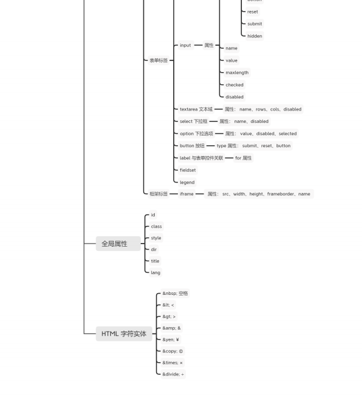
